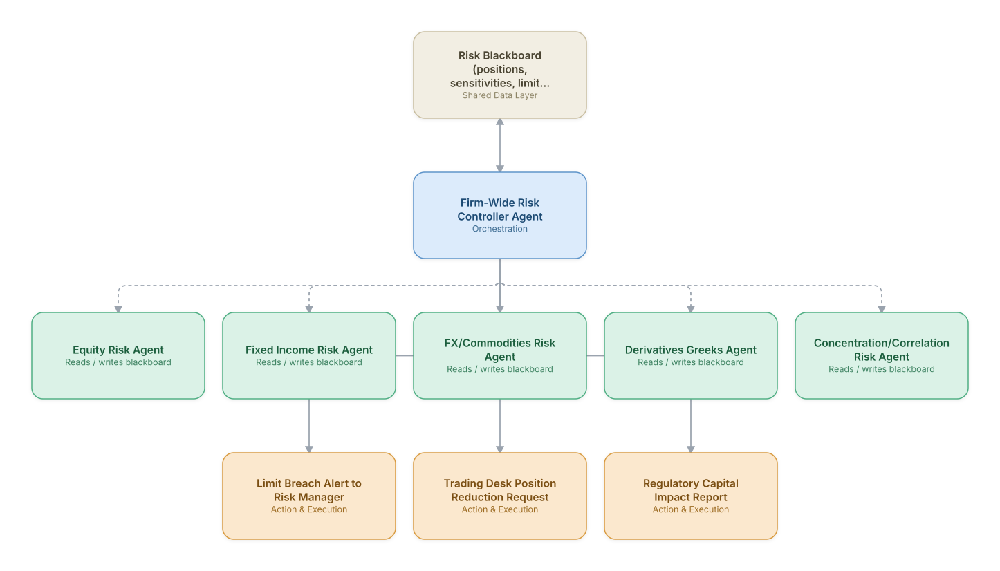

# 12. Market Risk Management / VaR Monitoring

**Domain:** Financial Services &nbsp;|&nbsp; **Architecture pattern:** [Blackboard / Shared-Memory]({{ '/patterns/blackboard/' | relative_url }})

> 🧠 **Deep dive available:** this use case also has a full [8-Layer Regenerative Architecture breakdown]({{ '/deep8/finance/12-market-risk-var-monitoring/' | relative_url }}) — the same problem mapped through L1–L8, with an agent-level tools/technologies stack and a suggested build order by layer.

## 1. Problem Statement & Use Case

Trading desks and risk management need a real-time, firm-wide view of Value-at-Risk, stress-test exposure, and limit breaches across asset classes. Risk factors interact in non-obvious ways across desks, and siloed per-desk risk views miss firm-wide concentration risk. A blackboard architecture lets per-asset-class risk agents post findings that a controller synthesizes into a firm-wide risk picture.

## 2. End-to-End Multi-Agent Architecture

The solution is implemented as a **Blackboard / Shared-Memory** architecture. 
### 2.1 Agents & Sub-Agents

| Agent | Responsibility |
|---|---|
| Firm-Wide Risk Controller Agent | Monitors the blackboard for limit breaches and synthesizes cross-asset-class risk concentration |
| Equity Risk Agent | Computes equity VaR and factor exposures (beta, sector, style) and posts to the blackboard |
| Fixed Income Risk Agent | Computes duration, convexity, and credit-spread risk for the bond book |
| FX/Commodities Risk Agent | Computes currency and commodity exposure and posts hedging-need signals |
| Derivatives Greeks Agent | Aggregates delta/gamma/vega across the derivatives book |
| Concentration/Correlation Risk Agent | Watches the blackboard for correlated exposures across asset classes that individually look fine but combine into concentration risk |

### 2.2 Architecture Diagram

> This diagram is organized as a **layered architecture**: Data &amp; Integration → Orchestration → Agent →
> Action &amp; Execution, plus a cross-cutting Observability &amp; Governance layer (tracing, audit log,
> guardrails, and any human review checkpoint — shown in lavender). See the
> [E2E Platform Architecture]({{ '/architecture/e2e-platform-architecture/' | relative_url }}) for how this
> layering looks across all 60 use cases at once. A [Mermaid text source](architecture.mmd) of the same
> diagram is also available in this folder.

## 3. Technologies Used (per step)

| Step / Layer | Technology |
|---|---|
| Risk calculation | Existing risk engines (MSCI RiskMetrics/Axioma) as per-asset-class calculators |
| Blackboard store | Low-latency in-memory grid (Redis/Apache Ignite) for shared position/risk state |
| Controller reasoning | Claude synthesizing structured blackboard entries into a firm-wide risk narrative for the risk committee |
| Stress testing | Historical and hypothetical scenario engine run against the consolidated position blackboard |
| Alerting | Real-time limit-breach alerting to risk managers and desk heads |
| Regulatory reporting | Feed into capital calculation (linked to Use Case 7's Basel agents) |
| Audit | Full snapshot history of the blackboard for regulatory exam reconstruction |
| Dashboard | Real-time firm-wide risk dashboard for CRO and risk committee |

## 4. Suggested Build Order

**Phase 1 — one agent writing to the blackboard.** Get Equity Risk Agent reading and writing the shared store with Firm-Wide Risk Controller Agent just reading it back out, no synthesis logic yet. Prove the shared-state read/write mechanics before adding more writers.

**Phase 2 — add the remaining agents.** Bring Fixed Income Risk Agent, FX/Commodities Risk Agent, Derivatives Greeks Agent, Concentration/Correlation Risk Agent online, each writing independently to the blackboard. Build Firm-Wide Risk Controller Agent's synthesis logic — deciding which agent to trigger next and how to combine partial, sometimes-conflicting findings.

**Phase 3 — add a minimum-evidence threshold.** An early blackboard system will over-synthesize from sparse data; require a minimum number of corroborating agent findings before the controller surfaces a conclusion.

**Phase 4 — observability and feedback.** Snapshot the blackboard's state history so any synthesized conclusion can be traced back to exactly which agent findings produced it.

## 5. If We Rebuilt This: What Would Improve

- Kept all VaR/Greeks calculations in established, regulator-validated risk engines — agents orchestrate and synthesize, they do not replace validated quantitative models.
- Would add the concentration/correlation agent from day one; it was added after a near-miss where three desks independently built correlated exposure that no single desk view caught.
- Blackboard update latency across asset classes needed careful synchronization — stale FX data briefly caused a false concentration alert in early testing.
- Risk committee wanted the controller's narrative to explicitly cite which underlying positions drove a concentration finding, not just a summary conclusion.

---
[← Back to Financial Services index]({{ '/finance/' | relative_url }}) &nbsp;|&nbsp; [← Back to home]({{ '/' | relative_url }})
