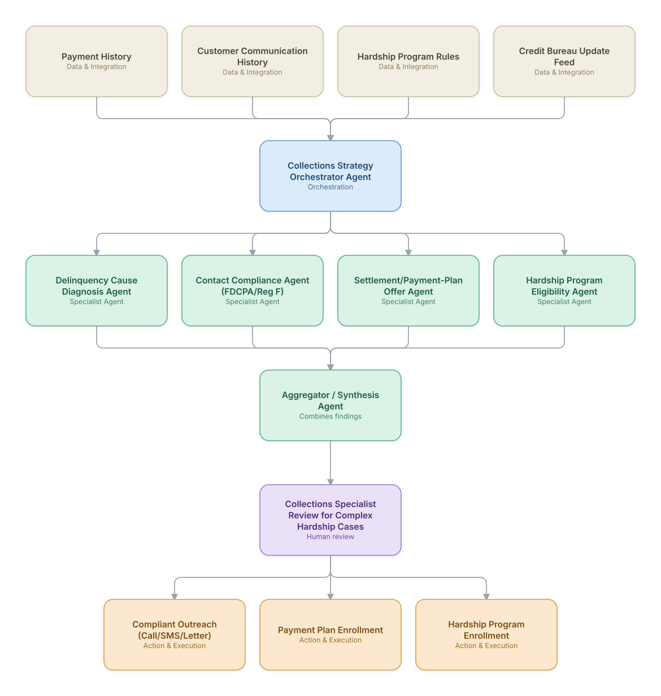

# 13. Collections & Delinquency Management

**Domain:** Financial Services &nbsp;|&nbsp; **Architecture pattern:** [Orchestrator-Worker (Supervisor fan-out/fan-in)](../../patterns/orchestrator-worker.md)

> 🧠 **Deep 8-Layer Regenerative Architecture:** not yet built for this use case — see the [Deep 8-Layer view](../../deep8/README.md) for what's currently available.

## 1. Problem Statement & Use Case

Effective collections requires tailoring contact strategy, timing, and settlement offers to each delinquent borrower's specific situation (hardship vs. simple oversight vs. unwillingness to pay) while strictly complying with FDCPA/Reg F contact-frequency and disclosure rules. Blanket collection scripts recover less and generate more complaints than a diagnosed, compliant, personalized approach.

## 2. End-to-End Multi-Agent Architecture

The solution is implemented as a **Orchestrator-Worker (Supervisor fan-out/fan-in)** architecture. 
**Human-in-the-loop checkpoint:** Collections Specialist Review for Complex Hardship Cases

### 2.1 Agents & Sub-Agents

| Agent | Responsibility |
|---|---|
| Collections Strategy Orchestrator | Diagnoses the delinquency situation and selects a compliant, tailored outreach and offer strategy |
| Delinquency Cause Diagnosis Agent | Infers likely cause (hardship, dispute, oversight) from payment pattern and any prior communication |
| Contact Compliance Agent | Enforces Reg F contact-frequency limits and required disclosures before any outreach is sent |
| Settlement/Payment-Plan Offer Agent | Generates an appropriate settlement or payment plan offer within approved policy bands |
| Hardship Program Eligibility Agent | Checks eligibility for hardship programs (forbearance, rate reduction) and initiates enrollment |

### 2.2 Architecture Diagram

> This diagram is organized as a **layered architecture**: Data &amp; Integration → Orchestration → Agent →
> Action &amp; Execution, plus a cross-cutting Observability &amp; Governance layer (tracing, audit log,
> guardrails, and any human review checkpoint — shown in lavender). See the
> [E2E Platform Architecture](../../architecture/e2e-platform-architecture.md) for how this layering looks
> across all 60 use cases at once. A [Mermaid text source](architecture.mmd) of the same diagram is also
> available in this folder.

## 3. Technologies Used (per step)

| Step / Layer | Technology |
|---|---|
| Diagnosis reasoning | Claude classifying delinquency cause from structured payment history + communication transcripts |
| Compliance engine | Rules engine encoding Reg F/FDCPA contact-frequency and disclosure requirements as hard gates |
| Offer optimization | Policy-constrained settlement optimization balancing recovery rate and compliance risk |
| Orchestration | LangGraph supervisor with compliance agent as a mandatory pre-send gate |
| Outreach channels | Dialer/SMS/mail integration with consent and opt-out tracking |
| Hardship processing | Integration with servicing system for program enrollment |
| Credit bureau reporting | Automated accurate/timely furnishing per FCRA requirements |
| Monitoring | Complaint-rate and recovery-rate dashboard segmented by strategy |

## 4. Suggested Build Order

**Phase 1 — one worker, no fan-out.** Wire a single path end to end: Delinquency Cause Diagnosis Agent reading real data and producing a result, with Collections Strategy Orchestrator Agent just passing data through untouched. Prove the data pipeline and one agent's reasoning before adding parallelism.

**Phase 2 — add the fan-out.** Bring the remaining 3 worker agents online in parallel and build Collections Strategy Orchestrator Agent's aggregation/synthesis logic. This is where the orchestrator-worker pattern is actually learned — watch for race conditions and partial-failure handling here, not before.

**Phase 3 — add the governance gate.** Wire in the human checkpoint: Collections Specialist Review for Complex Hardship Cases.

**Phase 4 — observability and feedback.** Trace every worker call, monitor the aggregator's decision quality against real outcomes, and add a feedback loop that catches drift before it becomes a production incident.

## 5. If We Rebuilt This: What Would Improve

- The Contact Compliance Agent has hard veto power over every outreach action, with no override path except through a documented human exception — this was non-negotiable given regulatory risk.
- Would add outcome-based strategy refinement earlier; v1 used static diagnosis-to-offer mapping rather than learning which offers actually worked for which diagnosed cause.
- Hardship eligibility checks needed broader data (beyond payment history) — would integrate income/employment-change signals earlier to catch hardship cases proactively rather than reactively.
- Complaint-driver analysis after launch showed most complaints came from contact-frequency edge cases across multiple accounts held by the same customer; added cross-account contact-frequency aggregation.

---
[← Back to Financial Services index](../README.md) &nbsp;|&nbsp; [← Back to home](../../../README.md)
