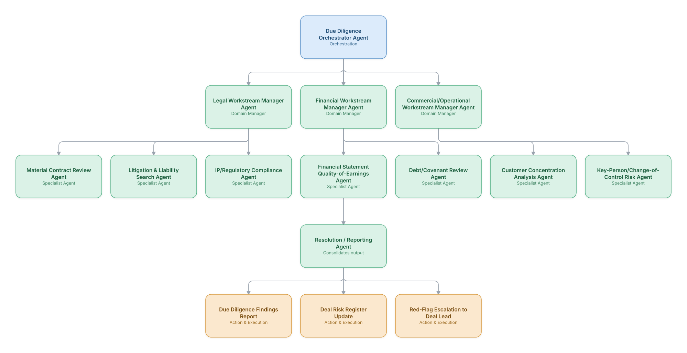

# 14. Mergers & Acquisitions Due Diligence

**Domain:** Financial Services &nbsp;|&nbsp; **Architecture pattern:** [Hierarchical Multi-Agent (Manager-of-Managers)](../../patterns/hierarchical.md)

> 🧠 **Deep dive available:** this use case also has a full [8-Layer Regenerative Architecture breakdown](../../deep8/finance/14-ma-due-diligence/README.md) — the same problem mapped through L1–L8, with an agent-level tools/technologies stack and a suggested build order by layer.

## 1. Problem Statement & Use Case

M&A due diligence requires reviewing thousands of contracts, financial records, and disclosures across legal, financial, and operational workstreams within a compressed deal timeline. Deal teams (bankers, lawyers, consultants) spend enormous hours on document review that a hierarchical agent team can accelerate while flagging deal-relevant risks for senior dealmakers.

## 2. End-to-End Multi-Agent Architecture

The solution is implemented as a **Hierarchical Multi-Agent (Manager-of-Managers)** architecture. 
### 2.1 Agents & Sub-Agents

| Agent | Responsibility |
|---|---|
| Due Diligence Orchestrator | Coordinates the three workstream managers and consolidates findings into a unified risk register |
| Legal Workstream Manager | Oversees contract, litigation, and IP/regulatory sub-agents |
| Financial Workstream Manager | Oversees quality-of-earnings and debt/covenant sub-agents |
| Material Contract Review Agent | Reviews key contracts for change-of-control clauses, assignment restrictions, and unusual terms |
| Financial Statement Quality-of-Earnings Agent | Identifies one-time items, revenue recognition issues, and normalized EBITDA adjustments |
| Customer Concentration Analysis Agent | Quantifies revenue concentration and contract-renewal risk among top customers |

### 2.2 Architecture Diagram

> This diagram is organized as a **layered architecture**: Data &amp; Integration → Orchestration → Agent →
> Action &amp; Execution, plus a cross-cutting Observability &amp; Governance layer (tracing, audit log,
> guardrails, and any human review checkpoint — shown in lavender). See the
> [E2E Platform Architecture](../../architecture/e2e-platform-architecture.md) for how this layering looks
> across all 60 use cases at once. A [Mermaid text source](architecture.mmd) of the same diagram is also
> available in this folder.

## 3. Technologies Used (per step)

| Step / Layer | Technology |
|---|---|
| Document ingestion | Virtual data room (VDR) integration with bulk document extraction (docx/pdf skills) |
| Contract analysis | Claude with clause-taxonomy extraction, similar to Use Case 9's contract review agent |
| Financial analysis | Structured financial data extraction + quality-of-earnings adjustment modeling |
| Orchestration | Hierarchical LangGraph processing documents in parallel across workstreams |
| Risk register | Structured findings database with severity/materiality tagging |
| Litigation search | Legal database API (PACER, Westlaw) integration for litigation history |
| Reporting | Auto-generated due diligence report (docx/pptx skills) for deal committee |
| Security | Strict access controls and data-room-level audit logging given deal confidentiality |

## 4. Suggested Build Order

**Phase 1 — one branch only.** Build Due Diligence Orchestrator Agent talking to just Legal Workstream Manager Agent and that manager's own leaf agents, ignoring the other 2 branches entirely. Prove one full manager-to-leaf chain before replicating it.

**Phase 2 — add the remaining branches.** Bring Financial Workstream Manager Agent, Commercial/Operational Workstream Manager Agent online, each with their own leaf agents. Build Due Diligence Orchestrator Agent's cross-branch consolidation logic — this is the actual hard part of the hierarchical pattern, not any single branch.

**Phase 3 — resolve cross-branch conflicts.** Real inputs will disagree across managers (different branches recommending incompatible actions); add explicit conflict-resolution logic at Due Diligence Orchestrator Agent rather than letting the last branch to report silently win.

**Phase 4 — observability and feedback.** Trace decisions at every level of the hierarchy separately (top orchestrator, each manager, each leaf) so a bad outcome can be traced to the specific branch and level that caused it.

## 5. If We Rebuilt This: What Would Improve

- Would build the risk-register consolidation and de-duplication logic earlier; findings initially overlapped heavily across workstreams (e.g., a contract flagged by both legal and commercial agents) without a clear reconciliation process.
- Deal teams valued materiality-ranked findings far more than exhaustive findings lists — added explicit materiality scoring after initial report was seen as overwhelming.
- Confidentiality/access control needed to be workstream-specific (not all deal team members should see all findings) — retrofitted this after an internal information-barrier concern.
- Quality-of-earnings analysis benefited enormously from historical deal comparables as few-shot grounding — would build this comparables library from the start.

---
[← Back to Financial Services index](../README.md) &nbsp;|&nbsp; [← Back to home](../../../README.md)
