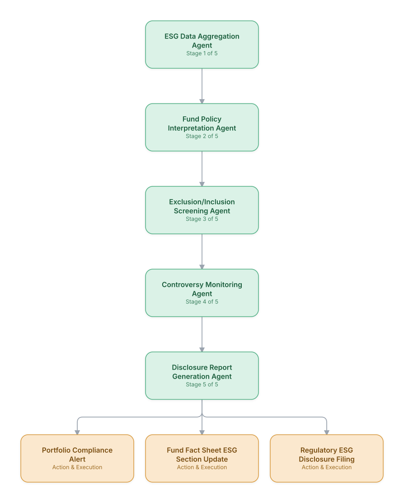

# 15. ESG Investment Screening & Compliance

**Domain:** Financial Services &nbsp;|&nbsp; **Architecture pattern:** [Sequential Pipeline]({{ '/patterns/pipeline/' | relative_url }})

> 🧠 **Deep dive available:** this use case also has a full [8-Layer Regenerative Architecture breakdown]({{ '/deep8/finance/15-esg-investment-screening/' | relative_url }}) — the same problem mapped through L1–L8, with an agent-level tools/technologies stack and a suggested build order by layer.

## 1. Problem Statement & Use Case

Asset managers must screen potential investments against ESG mandates, exclusionary criteria, and disclosure regulations (SFDR, SEC climate rules) that vary by fund. Manually cross-referencing company ESG data against each fund's specific policy is slow and inconsistent across analysts. A pipeline agent can screen the entire investable universe against every fund's specific ESG policy continuously.

## 2. End-to-End Multi-Agent Architecture

The solution is implemented as a **Sequential Pipeline** architecture. 
### 2.1 Agents & Sub-Agents

| Agent | Responsibility |
|---|---|
| ESG Data Aggregation Agent | Consolidates ESG ratings/data from multiple providers (MSCI, Sustainalytics, company disclosures) |
| Fund Policy Interpretation Agent | Extracts each fund's specific exclusionary and inclusionary ESG criteria from its prospectus/policy documents |
| Exclusion/Inclusion Screening Agent | Screens holdings and candidate investments against each fund's specific policy |
| Controversy Monitoring Agent | Continuously monitors for new ESG controversies (labor violations, environmental incidents) affecting held companies |
| Disclosure Report Generation Agent | Generates SFDR/SEC-compliant ESG disclosure reports per fund |

### 2.2 Architecture Diagram

> This diagram is organized as a **layered architecture**: Data &amp; Integration → Orchestration → Agent →
> Action &amp; Execution, plus a cross-cutting Observability &amp; Governance layer (tracing, audit log,
> guardrails, and any human review checkpoint — shown in lavender). See the
> [E2E Platform Architecture]({{ '/architecture/e2e-platform-architecture/' | relative_url }}) for how this
> layering looks across all 60 use cases at once. A [Mermaid text source](architecture.mmd) of the same
> diagram is also available in this folder.

## 3. Technologies Used (per step)

| Step / Layer | Technology |
|---|---|
| ESG data | MSCI ESG / Sustainalytics / Bloomberg ESG data feeds |
| Policy extraction | Claude + RAG over fund prospectus and ESG policy documents |
| Screening logic | Rules engine applying fund-specific inclusion/exclusion criteria |
| Controversy monitoring | News/controversy feed monitoring (RepRisk) with real-time alerting |
| Orchestration | Airflow pipeline running daily screening across the full fund lineup |
| Disclosure generation | Automated SFDR Annex/SEC climate-disclosure report generation (docx/pdf skills) |
| Portfolio integration | Integration with portfolio management system (Aladdin/Charles River) for compliance blocking |
| Audit | Full traceability from fund policy clause to screening decision for regulatory examination |

## 4. Suggested Build Order

**Phase 1 — the first two stages only.** Get ESG Data Aggregation Agent feeding Fund Policy Interpretation Agent correctly, with the rest of the pipeline stubbed out. Durability matters more than completeness here — make sure a crash mid-pipeline doesn't lose or duplicate work.

**Phase 2 — the full chain.** Add the remaining 3 stages in order, testing each newly-added stage against real output from the stage before it, not synthetic test data.

**Phase 3 — add retry and partial-failure handling.** Decide, stage by stage, what happens when that specific stage fails: retry, skip, or halt the whole pipeline. This decision is different per stage and shouldn't be a single global policy.

**Phase 4 — observability and feedback.** Add per-stage tracing so a slow or wrong pipeline run can be attributed to one specific stage, and track output quality over time to catch silent degradation in an early stage before it compounds downstream.

## 5. If We Rebuilt This: What Would Improve

- Fund policy interpretation needed compliance officer sign-off per fund before automation went live — ESG policy language is often ambiguous and getting it wrong has regulatory and reputational consequences.
- Would add the controversy monitoring agent earlier; a held company's labor controversy went undetected for weeks in the initial rollout because screening only ran against static data.
- Different ESG data providers frequently disagreed on ratings for the same company — added an explicit multi-provider disagreement flag rather than silently picking one source.
- Greenwashing risk meant disclosure report language needed careful, conservative grounding — added strict fact-citation requirements after internal legal review.

---
[← Back to Financial Services index]({{ '/finance/' | relative_url }}) &nbsp;|&nbsp; [← Back to home]({{ '/' | relative_url }})
