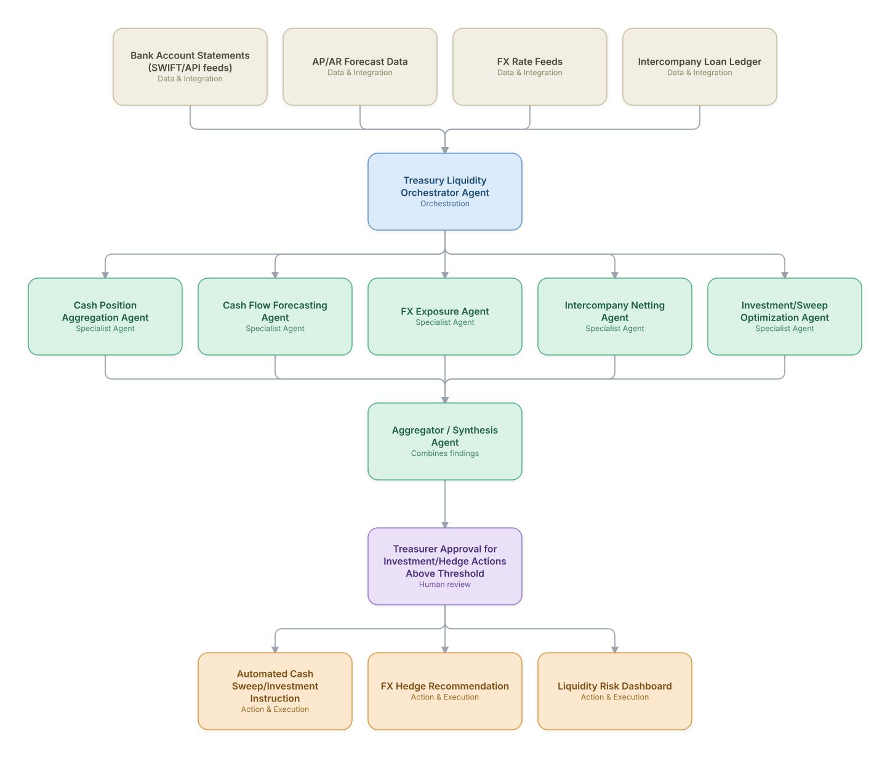

# 16. Treasury Cash Management & Liquidity Forecasting

**Domain:** Financial Services &nbsp;|&nbsp; **Architecture pattern:** [Orchestrator-Worker (Supervisor fan-out/fan-in)]({{ '/patterns/orchestrator-worker/' | relative_url }})

> 🧠 **Deep dive available:** this use case also has a full [8-Layer Regenerative Architecture breakdown]({{ '/deep8/finance/16-treasury-cash-liquidity-forecasting/' | relative_url }}) — the same problem mapped through L1–L8, with an agent-level tools/technologies stack and a suggested build order by layer.

## 1. Problem Statement & Use Case

Corporate and bank treasury functions need accurate, near-real-time visibility into cash positions across many accounts/entities/currencies to optimize liquidity, meet regulatory liquidity ratios, and avoid costly overdrafts or idle cash. Manual consolidation across banking relationships and business units introduces lag and error into decisions that need to happen same-day.

## 2. End-to-End Multi-Agent Architecture

The solution is implemented as a **Orchestrator-Worker (Supervisor fan-out/fan-in)** architecture. 
**Human-in-the-loop checkpoint:** Treasurer Approval for Investment/Hedge Actions Above Threshold

### 2.1 Agents & Sub-Agents

| Agent | Responsibility |
|---|---|
| Treasury Liquidity Orchestrator | Consolidates all agent outputs into a single global cash position and optimal-use recommendation |
| Cash Position Aggregation Agent | Pulls real-time balances across all bank accounts/entities/currencies via SWIFT/API |
| Cash Flow Forecasting Agent | Forecasts near-term inflows/outflows from AP/AR pipelines and known obligations |
| FX Exposure Agent | Calculates net FX exposure across entities and flags hedging needs |
| Intercompany Netting Agent | Optimizes intercompany settlement to minimize cross-border transfer costs and FX conversions |
| Investment/Sweep Optimization Agent | Recommends optimal allocation of excess cash across sweep accounts/short-term investments |

### 2.2 Architecture Diagram

> This diagram is organized as a **layered architecture**: Data &amp; Integration → Orchestration → Agent →
> Action &amp; Execution, plus a cross-cutting Observability &amp; Governance layer (tracing, audit log,
> guardrails, and any human review checkpoint — shown in lavender). See the
> [E2E Platform Architecture]({{ '/architecture/e2e-platform-architecture/' | relative_url }}) for how this
> layering looks across all 60 use cases at once. A [Mermaid text source](architecture.mmd) of the same
> diagram is also available in this folder.

## 3. Technologies Used (per step)

| Step / Layer | Technology |
|---|---|
| Bank connectivity | SWIFT MT/MX and bank API aggregation (via a TMS like Kyriba/GTreasury) |
| Forecasting | ML-based cash flow forecasting incorporating AP/AR system data |
| FX management | Real-time FX rate feeds + exposure netting calculation |
| Orchestration | LangGraph supervisor combining position, forecast, and optimization agents |
| Optimization | Linear programming for optimal cash allocation across sweep/investment vehicles |
| Execution | Automated payment/investment instruction generation with bank API execution |
| Compliance | Segregation-of-duties enforcement — no single agent both recommends and executes above threshold |
| Dashboard | Real-time global liquidity position dashboard for treasury team |

## 4. Suggested Build Order

**Phase 1 — one worker, no fan-out.** Wire a single path end to end: Cash Position Aggregation Agent reading real data and producing a result, with Treasury Liquidity Orchestrator Agent just passing data through untouched. Prove the data pipeline and one agent's reasoning before adding parallelism.

**Phase 2 — add the fan-out.** Bring the remaining 4 worker agents online in parallel and build Treasury Liquidity Orchestrator Agent's aggregation/synthesis logic. This is where the orchestrator-worker pattern is actually learned — watch for race conditions and partial-failure handling here, not before.

**Phase 3 — add the governance gate.** Wire in the human checkpoint: Treasurer Approval for Investment/Hedge Actions Above Threshold.

**Phase 4 — observability and feedback.** Trace every worker call, monitor the aggregator's decision quality against real outcomes, and add a feedback loop that catches drift before it becomes a production incident.

## 5. If We Rebuilt This: What Would Improve

- Segregation of duties (recommend vs. execute, with independent approval) was built in from the start given the direct financial-movement risk — this proved essential during a vendor API bug that would have caused an erroneous sweep.
- Cash flow forecasting accuracy was heavily dependent on AP/AR system data quality; would invest in data-quality validation agents earlier rather than assuming clean upstream data.
- Would add scenario stress-testing (e.g., a major customer payment delay) to the forecasting agent from the start, not just point forecasts.
- Cross-currency netting optimization needed real transfer-cost data per banking corridor, which was more heterogeneous than initially modeled — required significant refinement post-launch.

---
[← Back to Financial Services index]({{ '/finance/' | relative_url }}) &nbsp;|&nbsp; [← Back to home]({{ '/' | relative_url }})
