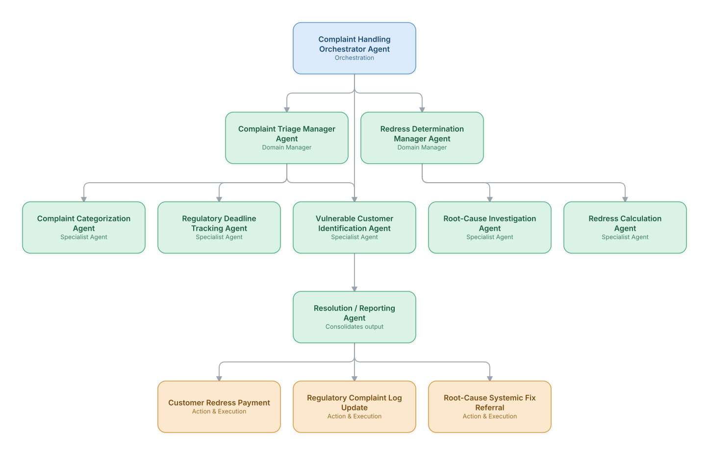

# 18. Customer Complaint Handling (Regulatory Compliance)

**Domain:** Financial Services &nbsp;|&nbsp; **Architecture pattern:** [Hierarchical Multi-Agent (Manager-of-Managers)]({{ '/patterns/hierarchical/' | relative_url }})

> 🧠 **Deep dive available:** this use case also has a full [8-Layer Regenerative Architecture breakdown]({{ '/deep8/finance/18-complaint-handling-regulatory-compliance/' | relative_url }}) — the same problem mapped through L1–L8, with an agent-level tools/technologies stack and a suggested build order by layer.

## 1. Problem Statement & Use Case

Financial institutions must handle customer complaints within strict regulatory timeframes (e.g., CFPB, FCA 8-week rules) with proper categorization, root-cause tracking, and redress calculation, or face fines and consent orders. Manual complaint handling struggles with consistent categorization and timely, adequate redress determination across high volumes.

## 2. End-to-End Multi-Agent Architecture

The solution is implemented as a **Hierarchical Multi-Agent (Manager-of-Managers)** architecture. 
### 2.1 Agents & Sub-Agents

| Agent | Responsibility |
|---|---|
| Complaint Handling Orchestrator | Routes each complaint through triage and redress workstreams, tracking regulatory deadlines end-to-end |
| Complaint Triage Manager | Oversees categorization, deadline-tracking, and vulnerable-customer sub-agents |
| Redress Determination Manager | Oversees root-cause investigation and redress-calculation sub-agents |
| Complaint Categorization Agent | Classifies the complaint per regulatory taxonomy (e.g., FCA's complaint categories) |
| Vulnerable Customer Identification Agent | Flags indicators of customer vulnerability requiring enhanced care per regulatory guidance |
| Redress Calculation Agent | Computes fair redress (refund, compensation, corrective action) per the root cause and regulatory guidance |

### 2.2 Architecture Diagram

> This diagram is organized as a **layered architecture**: Data &amp; Integration → Orchestration → Agent →
> Action &amp; Execution, plus a cross-cutting Observability &amp; Governance layer (tracing, audit log,
> guardrails, and any human review checkpoint — shown in lavender). See the
> [E2E Platform Architecture]({{ '/architecture/e2e-platform-architecture/' | relative_url }}) for how this
> layering looks across all 60 use cases at once. A [Mermaid text source](architecture.mmd) of the same
> diagram is also available in this folder.

## 3. Technologies Used (per step)

| Step / Layer | Technology |
|---|---|
| Complaint intake | Omnichannel intake (call, email, letter, app) normalized into a case management system |
| Categorization | LLM classifier grounded in the regulator's official complaint taxonomy |
| Deadline tracking | Rules engine encoding jurisdiction-specific regulatory response deadlines |
| Vulnerability detection | Careful, conservative classifier flagging vulnerability indicators for enhanced-care routing to trained staff |
| Root-cause investigation | Tool-calling agent gathering evidence across relevant systems (similar pattern to Use Case 10, telecom billing disputes) |
| Redress calculation | Deterministic rules engine, not LLM-generated, for financial redress accuracy |
| Orchestration | Hierarchical LangGraph with hard SLA-deadline alerting |
| Regulatory reporting | Automated complaint-log submission per regulator format |

## 4. Suggested Build Order

**Phase 1 — one branch only.** Build Complaint Handling Orchestrator Agent talking to just Complaint Triage Manager Agent and that manager's own leaf agents, ignoring the other 1 branch entirely. Prove one full manager-to-leaf chain before replicating it.

**Phase 2 — add the remaining branches.** Bring Redress Determination Manager Agent online, each with their own leaf agents. Build Complaint Handling Orchestrator Agent's cross-branch consolidation logic — this is the actual hard part of the hierarchical pattern, not any single branch.

**Phase 3 — resolve cross-branch conflicts.** Real inputs will disagree across managers (different branches recommending incompatible actions); add explicit conflict-resolution logic at Complaint Handling Orchestrator Agent rather than letting the last branch to report silently win.

**Phase 4 — observability and feedback.** Trace decisions at every level of the hierarchy separately (top orchestrator, each manager, each leaf) so a bad outcome can be traced to the specific branch and level that caused it.

## 5. If We Rebuilt This: What Would Improve

- Vulnerable-customer identification was deliberately built conservative (flag more, not less) and always routes to a trained human, never a fully automated resolution — given the sensitivity, this was a hard requirement from the start.
- Would add a systemic-issue detection agent earlier (patterns across many complaints pointing to a product/process bug) — this was originally out of scope but proved to be the highest-value output for the business.
- Kept redress calculation in deterministic rules engines after seeing the billing-dispute lesson (Telecom Use Case 10) about not trusting generative math for financial amounts.
- Regulatory deadline tracking needed buffer time built in for human review steps, not just the raw regulatory deadline — an early near-miss on an 8-week case prompted this change.

---
[← Back to Financial Services index]({{ '/finance/' | relative_url }}) &nbsp;|&nbsp; [← Back to home]({{ '/' | relative_url }})
