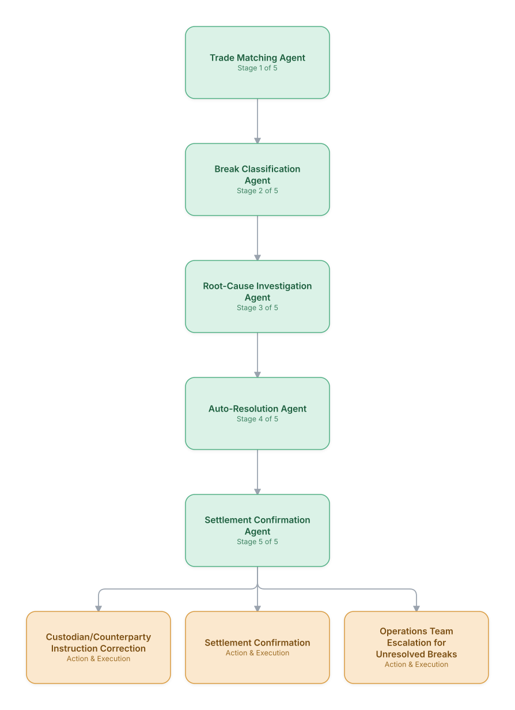

# 19. Trade Settlement Reconciliation

**Domain:** Financial Services &nbsp;|&nbsp; **Architecture pattern:** [Sequential Pipeline](../../patterns/pipeline.md)

> 🧠 **Deep dive available:** this use case also has a full [8-Layer Regenerative Architecture breakdown](../../deep8/finance/19-trade-settlement-reconciliation/README.md) — the same problem mapped through L1–L8, with an agent-level tools/technologies stack and a suggested build order by layer.

## 1. Problem Statement & Use Case

Post-trade settlement requires matching trade details across counterparties, custodians, and internal books before T+1/T+2 settlement deadlines. Breaks (mismatches) require rapid investigation to avoid settlement failures, which carry financial and regulatory penalties. An automated pipeline can triage and resolve the majority of routine breaks well within settlement windows.

## 2. End-to-End Multi-Agent Architecture

The solution is implemented as a **Sequential Pipeline** architecture. 
### 2.1 Agents & Sub-Agents

| Agent | Responsibility |
|---|---|
| Trade Matching Agent | Matches internal trade records against counterparty/custodian confirmations across key fields |
| Break Classification Agent | Classifies mismatches by type (price, quantity, settlement date, static data) and severity |
| Root-Cause Investigation Agent | Traces the break back to its source (trade booking error, static data mismatch, corporate action) |
| Auto-Resolution Agent | Resolves well-understood break types automatically per pre-approved resolution rules |
| Settlement Confirmation Agent | Confirms final settlement instructions once the break is resolved |

### 2.2 Architecture Diagram

> This diagram is organized as a **layered architecture**: Data &amp; Integration → Orchestration → Agent →
> Action &amp; Execution, plus a cross-cutting Observability &amp; Governance layer (tracing, audit log,
> guardrails, and any human review checkpoint — shown in lavender). See the
> [E2E Platform Architecture](../../architecture/e2e-platform-architecture.md) for how this layering looks
> across all 60 use cases at once. A [Mermaid text source](architecture.mmd) of the same diagram is also
> available in this folder.

## 3. Technologies Used (per step)

| Step / Layer | Technology |
|---|---|
| Trade matching | Automated matching engine (similar to DTCC CTM) comparing trade legs across parties |
| Break classification | Rules + ML classifier trained on historical break categories |
| Root-cause investigation | Tool-calling agent querying trade booking, static data, and corporate-action systems |
| Auto-resolution | Deterministic resolution rules for known break types (e.g., standard settlement instruction updates) |
| Orchestration | Temporal workflow with T+1/T+2 deadline-aware prioritization |
| LLM usage | Claude for root-cause narrative and unresolved-break escalation summaries |
| Settlement integration | SWIFT messaging (MT54x series) for instruction confirmation |
| Monitoring | Break-aging dashboard prioritizing near-deadline unresolved breaks |

## 4. Suggested Build Order

**Phase 1 — the first two stages only.** Get Trade Matching Agent feeding Break Classification Agent correctly, with the rest of the pipeline stubbed out. Durability matters more than completeness here — make sure a crash mid-pipeline doesn't lose or duplicate work.

**Phase 2 — the full chain.** Add the remaining 3 stages in order, testing each newly-added stage against real output from the stage before it, not synthetic test data.

**Phase 3 — add retry and partial-failure handling.** Decide, stage by stage, what happens when that specific stage fails: retry, skip, or halt the whole pipeline. This decision is different per stage and shouldn't be a single global policy.

**Phase 4 — observability and feedback.** Add per-stage tracing so a slow or wrong pipeline run can be attributed to one specific stage, and track output quality over time to catch silent degradation in an early stage before it compounds downstream.

## 5. If We Rebuilt This: What Would Improve

- Would prioritize the deadline-aware triage logic (which breaks are closest to failing settlement) from day one rather than processing breaks in arrival order — this had the single biggest impact on reducing settlement fails.
- Auto-resolution rules were kept narrow and conservative initially (only the most common, lowest-risk break types); expanded gradually as confidence built, rather than attempting broad auto-resolution from launch.
- Static data quality (incorrect settlement instructions on file) was a bigger root cause than trade-booking errors — would invest more in static-data-quality agents relative to trade-matching sophistication.
- Corporate-action-driven breaks (dividends, splits) needed a dedicated sub-agent with calendar awareness — initially handled poorly as generic 'quantity mismatch' breaks.

---
[← Back to Financial Services index](../README.md) &nbsp;|&nbsp; [← Back to home](../../../README.md)
