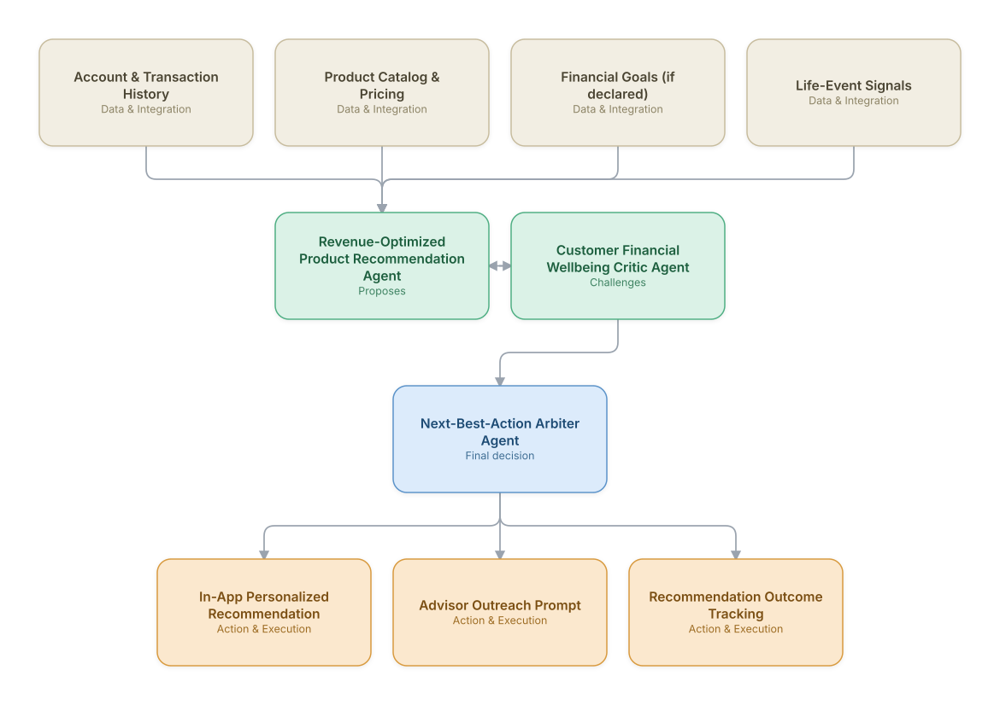

# 20. Personalized Financial Advisory & Next-Best-Action

**Domain:** Financial Services &nbsp;|&nbsp; **Architecture pattern:** [Debate-Critique-Arbiter (Reflective Loop)]({{ '/patterns/debate-critique/' | relative_url }})

> 🧠 **Deep dive available:** this use case also has a full [8-Layer Regenerative Architecture breakdown]({{ '/deep8/finance/20-personalized-financial-advisory-nba/' | relative_url }}) — the same problem mapped through L1–L8, with an agent-level tools/technologies stack and a suggested build order by layer.

## 1. Problem Statement & Use Case

Retail banks and wealth platforms want to proactively recommend relevant financial actions (refinancing, savings goals, investment products) to customers, but purely revenue-optimized recommendation engines risk recommending products that don't serve the customer's actual financial interest, creating suitability and trust issues. A proposer/critic design, mirroring the telecom upsell use case, balances business value against genuine customer benefit.

## 2. End-to-End Multi-Agent Architecture

The solution is implemented as a **Debate-Critique-Arbiter (Reflective Loop)** architecture. 
### 2.1 Agents & Sub-Agents

| Agent | Responsibility |
|---|---|
| Revenue-Optimized Product Recommendation Agent | Proposes the product/action with highest expected revenue given the customer's profile |
| Customer Financial Wellbeing Critic Agent | Checks whether the proposal genuinely improves the customer's financial position (e.g., refinancing that actually lowers their cost) |
| Next-Best-Action Arbiter Agent | Balances revenue and wellbeing signals into a final recommendation with a transparent rationale |
| Life-Event Detection Agent | Detects signals of major life events (home purchase, new job, retirement approaching) from transaction patterns |
| Outcome Tracking Agent | Monitors whether accepted recommendations actually improved the customer's financial metrics over time |

### 2.2 Architecture Diagram

> This diagram is organized as a **layered architecture**: Data &amp; Integration → Orchestration → Agent →
> Action &amp; Execution, plus a cross-cutting Observability &amp; Governance layer (tracing, audit log,
> guardrails, and any human review checkpoint — shown in lavender). See the
> [E2E Platform Architecture]({{ '/architecture/e2e-platform-architecture/' | relative_url }}) for how this
> layering looks across all 60 use cases at once. A [Mermaid text source](architecture.mmd) of the same
> diagram is also available in this folder.

## 3. Technologies Used (per step)

| Step / Layer | Technology |
|---|---|
| Transaction analysis | Categorization and pattern-detection ML on transaction history |
| Recommendation proposer | Uplift/propensity model for product recommendation, same architecture pattern as Telecom Use Case 20 |
| Wellbeing critic | Rules + LLM reasoning checking financial-benefit criteria (e.g., total-cost comparison for refinancing) |
| Arbitration | Multi-objective scoring balancing revenue and a mandatory minimum wellbeing-benefit threshold |
| Life-event detection | Sequence-pattern model on transaction categories signaling major life changes |
| Delivery | In-app notification + advisor CRM integration for high-value/complex recommendations |
| Compliance | Suitability documentation auto-generated per recommendation for regulatory record-keeping |
| Outcome tracking | Longitudinal tracking of accepted-recommendation customer financial outcomes |

## 4. Suggested Build Order

**Phase 1 — the proposer alone.** Get Revenue-Optimized Product Recommendation Agent producing a hypothesis from real data, with no critic yet — this is just a single-pass classifier/recommender at this stage, and that's fine.

**Phase 2 — add the critic, fully independent.** Build Customer Financial Wellbeing Critic Agent with no visibility into the proposer's reasoning — separate context, separate prompt. This independence is the entire point of the pattern; skipping it turns the critic into a rubber stamp.

**Phase 3 — add Next-Best-Action Arbiter Agent and calibrate.** Build the arbitration logic, then run it against a set of cases with known-correct outcomes to calibrate how much weight the critic's pushback should carry before trusting it on live decisions.

**Phase 4 — observability and feedback.** Track how often the arbiter overrides the proposer and whether those overrides were actually correct — this tells you whether the critic is earning its place in the pipeline or just adding latency.

## 5. If We Rebuilt This: What Would Improve

- Set a hard minimum wellbeing-benefit threshold that the arbiter cannot override for revenue reasons — this is the direct lesson carried from watching purely revenue-optimized recommenders erode long-term trust in comparable systems.
- Would build the outcome-tracking agent from the start rather than adding it later; without it, there was no way to prove the wellbeing critic was actually improving customer outcomes versus just suppressing offers.
- Life-event detection had real customer trust upside (e.g., surfacing a genuinely useful savings product after a life change) but needed careful pacing to avoid feeling surveillance-like — added explicit customer transparency about why a recommendation appeared.
- Suitability documentation requirements meant the arbiter's rationale had to be far more structured/citation-grounded than an initial free-text version allowed.

---
[← Back to Financial Services index]({{ '/finance/' | relative_url }}) &nbsp;|&nbsp; [← Back to home]({{ '/' | relative_url }})
