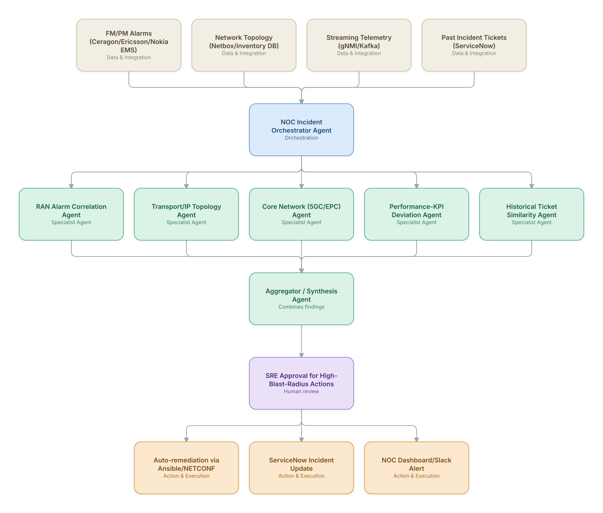

# 01. Multi-Agent Network Fault RCA & Auto-Remediation

**Domain:** Telecommunications &nbsp;|&nbsp; **Architecture pattern:** [Orchestrator-Worker (Supervisor fan-out/fan-in)](../../patterns/orchestrator-worker.md)

> 🧠 **Deep dive available:** this use case also has a full [8-Layer Regenerative Architecture breakdown](../../deep8/telecom/01-network-fault-rca-remediation/README.md) — the same problem mapped through L1–L8, with an agent-level tools/technologies stack and a suggested build order by layer.

## 1. Problem Statement & Use Case

A tier-1 operator's NOC receives thousands of correlated alarms per hour across RAN, transport, and core domains during a fault storm (e.g., a fiber cut or a core VNF crash). Human engineers spend 40-60 minutes just correlating alarms to find the true root cause before remediation even starts, driving SLA breaches and customer complaints. The goal is to compress alarm storms into a single root-cause hypothesis with confidence score and, where safe, trigger auto-remediation within minutes instead of hours.

## 2. End-to-End Multi-Agent Architecture

The solution is implemented as a **Orchestrator-Worker (Supervisor fan-out/fan-in)** architecture. 
**Human-in-the-loop checkpoint:** SRE Approval for High-Blast-Radius Actions

### 2.1 Agents & Sub-Agents

| Agent | Responsibility |
|---|---|
| NOC Incident Orchestrator | Fans out alarm bursts to domain agents, aggregates hypotheses, ranks root cause by confidence |
| RAN Alarm Correlation Agent | Deduplicates and correlates RAN alarms (cell down, PCI conflicts) against topology |
| Transport/IP Topology Agent | Traces fiber/microwave/IP path failures using topology graph traversal |
| Core Network Agent | Inspects 5GC/EPC VNF health, pod restarts, and signaling failures via Kubernetes/OSS APIs |
| Performance-KPI Deviation Agent | Detects statistically abnormal KPI drops (drop call rate, throughput) via time-series models |
| Historical Ticket Similarity Agent | RAG search over past incident tickets to suggest proven fixes |
| Remediation Execution Agent | Generates and (post-approval) executes Ansible/NETCONF playbooks |

### 2.2 Architecture Diagram

> This diagram is organized as a **layered architecture**: Data &amp; Integration → Orchestration → Agent →
> Action &amp; Execution, plus a cross-cutting Observability &amp; Governance layer (tracing, audit log,
> guardrails, and any human review checkpoint — shown in lavender). See the
> [E2E Platform Architecture](../../architecture/e2e-platform-architecture.md) for how this layering looks
> across all 60 use cases at once. A [Mermaid text source](architecture.mmd) of the same diagram is also
> available in this folder.

## 3. Technologies Used (per step)

| Step / Layer | Technology |
|---|---|
| Alarm ingestion | Kafka + FM/PM adapters (SNMP/gNMI) |
| Agent orchestration | LangGraph / AWS Bedrock Agents Supervisor pattern |
| Topology graph | Neo4j graph DB for network topology traversal |
| Time-series anomaly detection | Prophet / Nixtla + Isolation Forest |
| RAG over tickets | Vector DB (pgvector/Weaviate) + embeddings |
| LLM reasoning | Claude (tool-use) for hypothesis generation and NL incident summaries |
| Remediation execution | Ansible AWX / NETCONF (ncclient) with dry-run diff |
| Observability | Grafana + OpenTelemetry tracing of agent decisions |

## 4. Suggested Build Order

**Phase 1 — one worker, no fan-out.** Wire a single path end to end: RAN Alarm Correlation Agent reading real data and producing a result, with NOC Incident Orchestrator Agent just passing data through untouched. Prove the data pipeline and one agent's reasoning before adding parallelism.

**Phase 2 — add the fan-out.** Bring the remaining 4 worker agents online in parallel and build NOC Incident Orchestrator Agent's aggregation/synthesis logic. This is where the orchestrator-worker pattern is actually learned — watch for race conditions and partial-failure handling here, not before.

**Phase 3 — add the governance gate.** Wire in the human checkpoint: SRE Approval for High-Blast-Radius Actions.

**Phase 4 — observability and feedback.** Trace every worker call, monitor the aggregator's decision quality against real outcomes, and add a feedback loop that catches drift before it becomes a production incident.

## 5. If We Rebuilt This: What Would Improve

- Add a confidence-calibration step: log every agent's predicted-vs-actual root cause to retrain ranking weights monthly.
- Introduce a blast-radius simulator agent that dry-runs remediation against a digital twin before touching production.
- Move from a single orchestrator to two-tier hierarchy once alarm volume exceeds ~5k/hr to avoid orchestrator context overload.
- Cache topology subgraphs per incident to cut RAG/graph query latency, which dominated the initial p95 response time.

---
[← Back to Telecommunications index](../README.md) &nbsp;|&nbsp; [← Back to home](../../../README.md)
