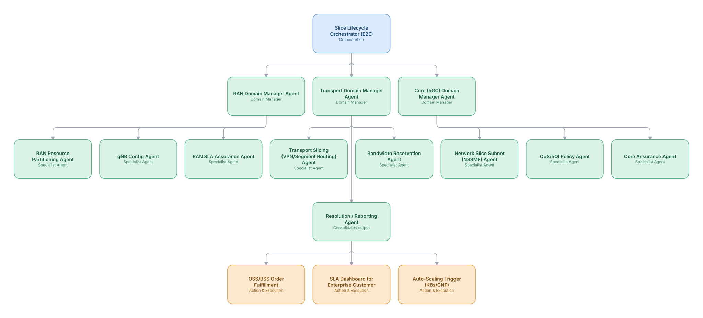

# 02. 5G Network Slice Lifecycle Orchestration

**Domain:** Telecommunications &nbsp;|&nbsp; **Architecture pattern:** [Hierarchical Multi-Agent (Manager-of-Managers)](../../patterns/hierarchical.md)

> 🧠 **Deep 8-Layer Regenerative Architecture:** not yet built for this use case — see the [Deep 8-Layer view](../../deep8/README.md) for what's currently available.

## 1. Problem Statement & Use Case

Enterprises request bespoke 5G network slices (low-latency for AR/VR factory floors, high-throughput for campus video, massive-IoT for sensors) with different SLAs. Manually designing, provisioning, and continuously assuring each slice across RAN, transport, and core domains takes weeks and is error-prone. The operator needs closed-loop, SLA-aware slice lifecycle management from intent to decommission.

## 2. End-to-End Multi-Agent Architecture

The solution is implemented as a **Hierarchical Multi-Agent (Manager-of-Managers)** architecture. 
### 2.1 Agents & Sub-Agents

| Agent | Responsibility |
|---|---|
| Slice Lifecycle Orchestrator | Translates enterprise intent (NEST template) into cross-domain design plan and tracks lifecycle state |
| RAN Domain Manager | Coordinates RAN-side slicing agents and reports RAN SLA compliance upward |
| Transport Domain Manager | Coordinates segment-routing/VPN agents to guarantee latency/bandwidth across transport |
| Core Domain Manager | Coordinates 5GC NSSMF/QoS agents for slice subnet instantiation |
| RAN SLA Assurance Agent | Continuously compares live RAN KPIs vs slice SLA and raises breach events |
| QoS/5QI Policy Agent | Maps enterprise requirements to 5QI/QoS flow policies in the PCF |
| Core Assurance Agent | Monitors slice subnet health and triggers auto-scaling of CNFs |

### 2.2 Architecture Diagram

> This diagram is organized as a **layered architecture**: Data &amp; Integration → Orchestration → Agent →
> Action &amp; Execution, plus a cross-cutting Observability &amp; Governance layer (tracing, audit log,
> guardrails, and any human review checkpoint — shown in lavender). See the
> [E2E Platform Architecture](../../architecture/e2e-platform-architecture.md) for how this layering looks
> across all 60 use cases at once. A [Mermaid text source](architecture.mmd) of the same diagram is also
> available in this folder.

## 3. Technologies Used (per step)

| Step / Layer | Technology |
|---|---|
| Intent capture | TM Forum NEST/GST templates parsed by an LLM intent-extraction agent |
| Agent framework | Hierarchical LangGraph graph-of-graphs (top orchestrator invokes sub-graphs) |
| RAN control | O-RAN RIC (near-RT/non-RT) xApps/rApps |
| Transport control | Segment Routing / SR-TE controller (Cisco XTC / Juniper) |
| Core control | 5GC NSSMF via 3GPP SA5 APIs, ETSI NFV MANO |
| Assurance/telemetry | Prometheus + Thanos federated across domains |
| Closed-loop policy | ONAP CLAMP-style control loops triggered by agent decisions |
| Enterprise portal | React/Next.js self-service slice ordering UI |

## 4. Suggested Build Order

**Phase 1 — one branch only.** Build Slice Lifecycle Orchestrator (E2E) talking to just RAN Domain Manager Agent and that manager's own leaf agents, ignoring the other 2 branches entirely. Prove one full manager-to-leaf chain before replicating it.

**Phase 2 — add the remaining branches.** Bring Transport Domain Manager Agent, Core (5GC) Domain Manager Agent online, each with their own leaf agents. Build Slice Lifecycle Orchestrator (E2E)'s cross-branch consolidation logic — this is the actual hard part of the hierarchical pattern, not any single branch.

**Phase 3 — resolve cross-branch conflicts.** Real inputs will disagree across managers (different branches recommending incompatible actions); add explicit conflict-resolution logic at Slice Lifecycle Orchestrator (E2E) rather than letting the last branch to report silently win.

**Phase 4 — observability and feedback.** Trace decisions at every level of the hierarchy separately (top orchestrator, each manager, each leaf) so a bad outcome can be traced to the specific branch and level that caused it.

## 5. If We Rebuilt This: What Would Improve

- Start with a shared cross-domain data model (3GPP SA5 + TM Forum) from day one; retrofitting it after each domain manager had its own schema cost a full sprint.
- Add a simulation/what-if agent so enterprise customers can preview SLA feasibility before committing an order.
- Give domain managers explicit negotiation protocol (not just command-response) so RAN/Transport/Core can jointly resolve conflicting resource constraints.
- Instrument each hierarchy level with distributed tracing early — debugging cross-domain failures without it was the biggest time sink.

---
[← Back to Telecommunications index](../README.md) &nbsp;|&nbsp; [← Back to home](../../../README.md)
