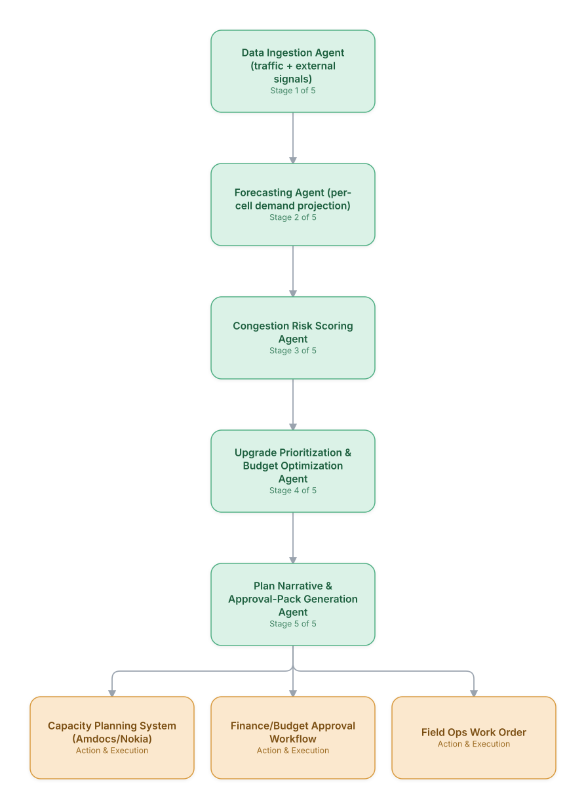

# 03. Proactive Capacity Planning & Traffic Forecasting

**Domain:** Telecommunications &nbsp;|&nbsp; **Architecture pattern:** [Sequential Pipeline](../../patterns/pipeline.md)

> 🧠 **Deep dive available:** this use case also has a full [8-Layer Regenerative Architecture breakdown](../../deep8/telecom/03-capacity-planning-traffic-forecasting/README.md) — the same problem mapped through L1–L8, with an agent-level tools/technologies stack and a suggested build order by layer.

## 1. Problem Statement & Use Case

Network planning teams manually forecast cell/site capacity using spreadsheets and quarterly reviews, missing fast-moving demand shifts from new housing developments, events, or seasonal tourism. This leads to either costly over-provisioning or congestion-driven churn. An automated pipeline is needed that ingests traffic trends, external signals (events, population growth), and produces prioritized capacity upgrade plans.

## 2. End-to-End Multi-Agent Architecture

The solution is implemented as a **Sequential Pipeline** architecture. 
### 2.1 Agents & Sub-Agents

| Agent | Responsibility |
|---|---|
| Data Ingestion Agent | Pulls PM counters, subscriber growth data, and external event/population feeds |
| Forecasting Agent | Runs per-cell time-series forecasting (traffic, PRB utilization) 3/6/12 months out |
| Congestion Risk Scoring Agent | Scores each site by probability and severity of SLA-impacting congestion |
| Upgrade Prioritization Agent | Optimizes upgrade sequence under a capex budget constraint (knapsack-style) |
| Plan Narrative Agent | Generates the human-readable business case and approval pack via LLM |

### 2.2 Architecture Diagram

> This diagram is organized as a **layered architecture**: Data &amp; Integration → Orchestration → Agent →
> Action &amp; Execution, plus a cross-cutting Observability &amp; Governance layer (tracing, audit log,
> guardrails, and any human review checkpoint — shown in lavender). See the
> [E2E Platform Architecture](../../architecture/e2e-platform-architecture.md) for how this layering looks
> across all 60 use cases at once. A [Mermaid text source](architecture.mmd) of the same diagram is also
> available in this folder.

## 3. Technologies Used (per step)

| Step / Layer | Technology |
|---|---|
| Data ingestion | Airflow DAGs pulling from PM systems and public event/census APIs |
| Forecasting | Nixtla TimeGPT / Prophet ensembles per cell-sector |
| Risk scoring | Gradient-boosted classifier (XGBoost) trained on historical congestion incidents |
| Optimization | OR-Tools / PuLP for constrained upgrade-sequence optimization |
| Narrative generation | Claude for business-case narrative + auto-generated slides |
| Orchestration | Prefect/Airflow pipeline invoking each agent as a task |
| Storage | Snowflake/BigQuery for PM history and forecast outputs |
| Approval workflow | ServiceNow/Jira integration for capex sign-off |

## 4. Suggested Build Order

**Phase 1 — the first two stages only.** Get Data Ingestion Agent (traffic + external signals) feeding Forecasting Agent (per-cell demand projection) correctly, with the rest of the pipeline stubbed out. Durability matters more than completeness here — make sure a crash mid-pipeline doesn't lose or duplicate work.

**Phase 2 — the full chain.** Add the remaining 3 stages in order, testing each newly-added stage against real output from the stage before it, not synthetic test data.

**Phase 3 — add retry and partial-failure handling.** Decide, stage by stage, what happens when that specific stage fails: retry, skip, or halt the whole pipeline. This decision is different per stage and shouldn't be a single global policy.

**Phase 4 — observability and feedback.** Add per-stage tracing so a slow or wrong pipeline run can be attributed to one specific stage, and track output quality over time to catch silent degradation in an early stage before it compounds downstream.

## 5. If We Rebuilt This: What Would Improve

- Pipeline (strictly sequential) was simpler to build but the forecasting stage became a bottleneck; would parallelize per-region forecasting as an orchestrator-worker sub-step.
- Add a feedback loop agent that compares realized traffic vs. forecast quarterly to auto-recalibrate models — this was manual in v1.
- Include a scenario-comparison agent (e.g., 'defer upgrade 1 quarter') rather than a single recommended plan.
- Validate external event-signal quality (e.g., stale population data) earlier; bad inputs silently degraded forecast accuracy for two release cycles.

---
[← Back to Telecommunications index](../README.md) &nbsp;|&nbsp; [← Back to home](../../../README.md)
