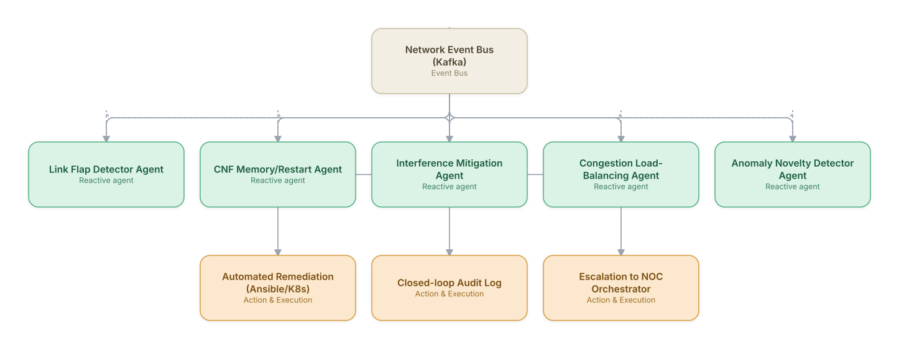

# 04. Self-Healing Network (Closed-Loop Automation)

**Domain:** Telecommunications &nbsp;|&nbsp; **Architecture pattern:** [Event-Driven Reactive Swarm](../../patterns/event-swarm.md)

> 🧠 **Deep 8-Layer Regenerative Architecture:** not yet built for this use case — see the [Deep 8-Layer view](../../deep8/README.md) for what's currently available.

## 1. Problem Statement & Use Case

Transient network degradations (interference spikes, memory leaks in CNFs, flapping links) require sub-minute reaction to avoid customer-visible impact, far faster than human-in-the-loop ticketing allows. The operator wants an always-on swarm of reactive agents subscribed to a shared event bus that can detect, decide, and act on well-understood fault classes autonomously, escalating only novel or high-risk situations.

## 2. End-to-End Multi-Agent Architecture

The solution is implemented as a **Event-Driven Reactive Swarm** architecture. 
### 2.1 Agents & Sub-Agents

| Agent | Responsibility |
|---|---|
| Link Flap Detector Agent | Subscribes to interface state-change events, detects flapping patterns and requests link dampening |
| CNF Memory/Restart Agent | Watches container memory/CPU metrics, triggers graceful pod restart before OOM-kill |
| Interference Mitigation Agent | Reacts to RF interference events by requesting PCI/frequency reassignment |
| Congestion Load-Balancing Agent | Shifts traffic via MLB (mobility load balancing) policies when PRB utilization crosses threshold |
| Anomaly Novelty Detector Agent | Flags event patterns unseen in the last 90 days and escalates to human/orchestrator rather than auto-acting |

### 2.2 Architecture Diagram

> This diagram is organized as a **layered architecture**: Data &amp; Integration → Orchestration → Agent →
> Action &amp; Execution, plus a cross-cutting Observability &amp; Governance layer (tracing, audit log,
> guardrails, and any human review checkpoint — shown in lavender). See the
> [E2E Platform Architecture](../../architecture/e2e-platform-architecture.md) for how this layering looks
> across all 60 use cases at once. A [Mermaid text source](architecture.mmd) of the same diagram is also
> available in this folder.

## 3. Technologies Used (per step)

| Step / Layer | Technology |
|---|---|
| Event bus | Apache Kafka with schema-registry (Avro) topics per domain |
| Agent runtime | Lightweight event-driven agents (Python asyncio) subscribed via consumer groups |
| Decisioning | Rules engine (Drools) for known fault classes + LLM fallback for ambiguous events |
| Novelty detection | Autoencoder-based anomaly scoring on event embeddings |
| Remediation execution | Kubernetes operators + Ansible for CNF/VNF actions |
| Guardrails | Rate-limiter and blast-radius policy service to cap concurrent auto-actions |
| Audit/observability | Immutable audit log (append-only) + Grafana closed-loop dashboard |
| Escalation | PagerDuty/ServiceNow webhook from Novelty Detector Agent |

## 4. Suggested Build Order

**Phase 1 — one reactive agent.** Get Link Flap Detector Agent subscribed to Network Event Bus (Kafka) and reacting to real events, with no other agents listening yet. Prove the event-driven mechanics work under real event volume before adding more subscribers.

**Phase 2 — add the remaining agents.** Bring CNF Memory/Restart Agent, Interference Mitigation Agent, Congestion Load-Balancing Agent, Anomaly Novelty Detector Agent online as independent subscribers. Test what happens when multiple agents react to the *same* event — this is where swarm-specific bugs (duplicate actions, conflicting responses) show up.

**Phase 3 — add rate limits and blast-radius guardrails.** A reactive swarm with no shared coordination can act on the same trigger repeatedly; add per-agent and global rate limits before connecting real downstream actions.

**Phase 4 — observability and feedback.** Add distributed tracing across the event bus so a cascading reaction across multiple agents can be reconstructed after the fact, not just guessed at.

## 5. If We Rebuilt This: What Would Improve

- V1 had no global blast-radius guardrail; two agents independently restarting adjacent CNFs caused a cascading outage — added a shared rate-limiter service.
- Event schema evolution broke agents silently; would enforce schema-registry compatibility checks in CI from the start.
- Add a 'cool-down memory' so the same agent doesn't oscillate (act, revert, act) on a flapping condition — implemented reactively after an incident.
- Separate 'decide' and 'act' permissions per agent so lower-trust agents can only recommend, not execute, until proven reliable over N cycles.

---
[← Back to Telecommunications index](../README.md) &nbsp;|&nbsp; [← Back to home](../../../README.md)
