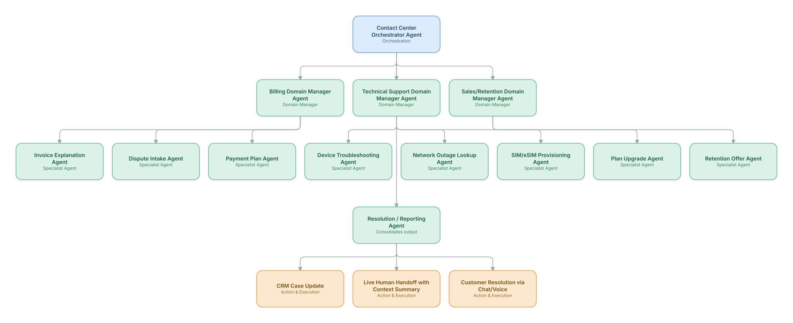

# 06. Intelligent Contact Center Triage & Resolution

**Domain:** Telecommunications &nbsp;|&nbsp; **Architecture pattern:** [Hierarchical Multi-Agent (Manager-of-Managers)](../../patterns/hierarchical.md)

> 🧠 **Deep 8-Layer Regenerative Architecture:** not yet built for this use case — see the [Deep 8-Layer view](../../deep8/README.md) for what's currently available.

## 1. Problem Statement & Use Case

Telecom contact centers field a mix of billing, technical, sales, and retention calls/chats. Misrouting and repeated hand-offs frustrate customers and inflate average handle time. The operator wants an agentic layer that classifies intent, resolves what it safely can end-to-end (plan changes, troubleshooting), and routes complex cases with full context to the right human specialist.

## 2. End-to-End Multi-Agent Architecture

The solution is implemented as a **Hierarchical Multi-Agent (Manager-of-Managers)** architecture. 
### 2.1 Agents & Sub-Agents

| Agent | Responsibility |
|---|---|
| Contact Center Orchestrator | Classifies intent from the incoming transcript and routes to the right domain manager |
| Billing Domain Manager | Coordinates billing sub-agents and decides if a human is required (e.g., disputes > $200) |
| Technical Support Domain Manager | Coordinates diagnostics sub-agents, checks for known outages before troubleshooting |
| Sales/Retention Domain Manager | Coordinates upgrade/offer sub-agents within approved discount bands |
| Network Outage Lookup Agent | Queries live outage map/NOC feed to short-circuit unnecessary troubleshooting |
| Device Troubleshooting Agent | Runs a decision-tree/RAG-grounded diagnostic flow with the customer |

### 2.2 Architecture Diagram

> This diagram is organized as a **layered architecture**: Data &amp; Integration → Orchestration → Agent →
> Action &amp; Execution, plus a cross-cutting Observability &amp; Governance layer (tracing, audit log,
> guardrails, and any human review checkpoint — shown in lavender). See the
> [E2E Platform Architecture](../../architecture/e2e-platform-architecture.md) for how this layering looks
> across all 60 use cases at once. A [Mermaid text source](architecture.mmd) of the same diagram is also
> available in this folder.

## 3. Technologies Used (per step)

| Step / Layer | Technology |
|---|---|
| Speech/chat interface | Genesys Cloud / Amazon Connect + real-time ASR (Deepgram) |
| Intent classification | Fine-tuned classifier + LLM fallback for long-tail intents |
| Orchestration | Hierarchical LangGraph with domain-manager sub-graphs |
| Knowledge grounding | RAG over knowledge base (Confluence export) via Weaviate |
| Outage lookup | Real-time query to NOC outage API |
| Human handoff | Structured case-summary auto-generated and injected into agent-desktop (Salesforce Service Cloud) |
| Guardrails | Discount/authority limits enforced as tool-call constraints, not prompt instructions alone |
| Analytics | Post-call QA scoring agent + dashboard for containment rate, CSAT |

## 4. Suggested Build Order

**Phase 1 — one branch only.** Build Contact Center Orchestrator Agent talking to just Billing Domain Manager Agent and that manager's own leaf agents, ignoring the other 2 branches entirely. Prove one full manager-to-leaf chain before replicating it.

**Phase 2 — add the remaining branches.** Bring Technical Support Domain Manager Agent, Sales/Retention Domain Manager Agent online, each with their own leaf agents. Build Contact Center Orchestrator Agent's cross-branch consolidation logic — this is the actual hard part of the hierarchical pattern, not any single branch.

**Phase 3 — resolve cross-branch conflicts.** Real inputs will disagree across managers (different branches recommending incompatible actions); add explicit conflict-resolution logic at Contact Center Orchestrator Agent rather than letting the last branch to report silently win.

**Phase 4 — observability and feedback.** Trace decisions at every level of the hierarchy separately (top orchestrator, each manager, each leaf) so a bad outcome can be traced to the specific branch and level that caused it.

## 5. If We Rebuilt This: What Would Improve

- Initial routing was intent-only; adding customer-value and sentiment signals to the orchestrator's routing decision meaningfully cut escalations for high-value customers.
- Handoff summaries were too verbose for agents to scan quickly — redesigned to a 5-bullet structured format after agent feedback.
- Would add a 'silent QA' critic agent reviewing bot resolutions in real time, rather than only sampling transcripts after the fact.
- Domain managers initially couldn't see each other's context (billing vs retention) causing duplicate offers; added a shared session-state store.

---
[← Back to Telecommunications index](../README.md) &nbsp;|&nbsp; [← Back to home](../../../README.md)
