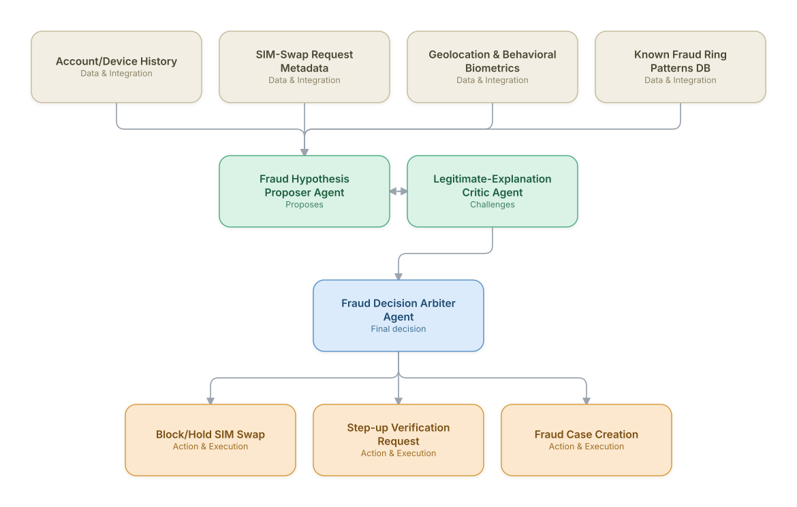

# 07. SIM-Swap & Account-Takeover Fraud Detection

**Domain:** Telecommunications &nbsp;|&nbsp; **Architecture pattern:** [Debate-Critique-Arbiter (Reflective Loop)]({{ '/patterns/debate-critique/' | relative_url }})

> 🧠 **Deep dive available:** this use case also has a full [8-Layer Regenerative Architecture breakdown]({{ '/deep8/telecom/07-sim-swap-fraud-detection/' | relative_url }}) — the same problem mapped through L1–L8, with an agent-level tools/technologies stack and a suggested build order by layer.

## 1. Problem Statement & Use Case

SIM-swap fraud is used to bypass SMS-based 2FA and take over banking/crypto accounts. Static rules generate too many false positives (blocking legitimate swaps for lost phones) or miss adversarial patterns. A reflective multi-agent design — a proposer that flags suspicious swaps and a critic that actively tries to find legitimate explanations — reduces both fraud loss and customer friction.

## 2. End-to-End Multi-Agent Architecture

The solution is implemented as a **Debate-Critique-Arbiter (Reflective Loop)** architecture. 
### 2.1 Agents & Sub-Agents

| Agent | Responsibility |
|---|---|
| Fraud Hypothesis Proposer Agent | Flags a swap request as suspicious based on velocity, geo-mismatch, and known fraud-ring signatures |
| Legitimate-Explanation Critic Agent | Actively searches for evidence supporting a legitimate reason (travel, new device, verified store visit) |
| Fraud Decision Arbiter Agent | Weighs proposer vs. critic evidence, sets final risk tier and required action |
| Step-up Verification Agent | Orchestrates additional identity checks (video KYC, security questions) when arbiter requests it |
| Fraud Ring Pattern-Matching Agent | Cross-references request against graph of known fraud rings/mule device clusters |

### 2.2 Architecture Diagram

> This diagram is organized as a **layered architecture**: Data &amp; Integration → Orchestration → Agent →
> Action &amp; Execution, plus a cross-cutting Observability &amp; Governance layer (tracing, audit log,
> guardrails, and any human review checkpoint — shown in lavender). See the
> [E2E Platform Architecture]({{ '/architecture/e2e-platform-architecture/' | relative_url }}) for how this
> layering looks across all 60 use cases at once. A [Mermaid text source](architecture.mmd) of the same
> diagram is also available in this folder.

## 3. Technologies Used (per step)

| Step / Layer | Technology |
|---|---|
| Graph analytics | Neo4j fraud graph (devices, SIMs, accounts, IPs) with graph embeddings |
| Proposer/critic reasoning | Two independently-prompted Claude instances with opposing objectives for adversarial robustness |
| Arbitration logic | Weighted scoring + human-reviewed calibration set, not a single LLM vote |
| Behavioral biometrics | Device/typing/location pattern service (BioCatch-style) |
| Step-up verification | Video KYC vendor API + OTP-alternative flows |
| Real-time decisioning | Sub-second scoring via a feature store + rules engine hybrid |
| Case management | Fraud case system (Actimize/SAS) integration |
| Monitoring | Precision/recall dashboard tracking false-positive customer friction rate |

## 4. Suggested Build Order

**Phase 1 — the proposer alone.** Get Fraud Hypothesis Proposer Agent producing a hypothesis from real data, with no critic yet — this is just a single-pass classifier/recommender at this stage, and that's fine.

**Phase 2 — add the critic, fully independent.** Build Legitimate-Explanation Critic Agent with no visibility into the proposer's reasoning — separate context, separate prompt. This independence is the entire point of the pattern; skipping it turns the critic into a rubber stamp.

**Phase 3 — add Fraud Decision Arbiter Agent and calibrate.** Build the arbitration logic, then run it against a set of cases with known-correct outcomes to calibrate how much weight the critic's pushback should carry before trusting it on live decisions.

**Phase 4 — observability and feedback.** Track how often the arbiter overrides the proposer and whether those overrides were actually correct — this tells you whether the critic is earning its place in the pipeline or just adding latency.

## 5. If We Rebuilt This: What Would Improve

- Early version let the arbiter be a third LLM vote, which correlated too much with the proposer's framing; replaced with a calibrated scoring function using both agents' extracted evidence.
- Add a periodic red-team agent that generates novel fraud patterns to stress-test the proposer/critic pair — this was only done manually at launch.
- Track false-positive customer impact (blocked legitimate swaps) as a first-class metric alongside fraud-caught; v1 over-indexed on fraud recall.
- Cache the critic's 'legitimate explanation' search results per customer to cut latency — regenerating full context every swap request was the biggest cost driver.

---
[← Back to Telecommunications index]({{ '/telecom/' | relative_url }}) &nbsp;|&nbsp; [← Back to home]({{ '/' | relative_url }})
