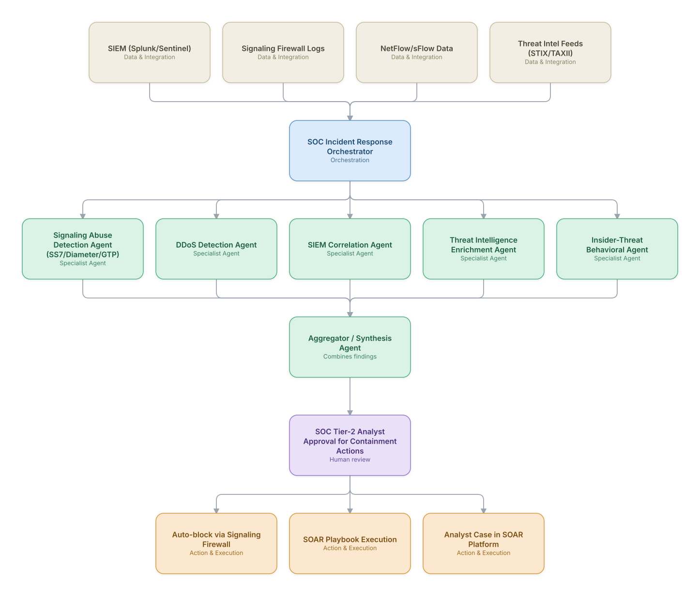

# 08. Telecom SOC Threat Hunting & Incident Response

**Domain:** Telecommunications &nbsp;|&nbsp; **Architecture pattern:** [Orchestrator-Worker (Supervisor fan-out/fan-in)]({{ '/patterns/orchestrator-worker/' | relative_url }})

> 🧠 **Deep dive available:** this use case also has a full [8-Layer Regenerative Architecture breakdown]({{ '/deep8/telecom/08-telecom-soc-threat-hunting/' | relative_url }}) — the same problem mapped through L1–L8, with an agent-level tools/technologies stack and a suggested build order by layer.

## 1. Problem Statement & Use Case

Telecom networks are high-value targets (signaling exploits, GTP/Diameter abuse, DDoS against core). SOC analysts are overwhelmed by SIEM alert volume and struggle to correlate signaling-layer anomalies with IT-security telemetry. An agentic SOC layer is needed to triage, enrich, and where appropriate auto-contain threats while keeping analysts in control of high-impact actions.

## 2. End-to-End Multi-Agent Architecture

The solution is implemented as a **Orchestrator-Worker (Supervisor fan-out/fan-in)** architecture. 
**Human-in-the-loop checkpoint:** SOC Tier-2 Analyst Approval for Containment Actions

### 2.1 Agents & Sub-Agents

| Agent | Responsibility |
|---|---|
| SOC Orchestrator | Fans out incoming alerts to specialized detection agents and aggregates a unified incident view |
| Signaling Abuse Detection Agent | Detects SS7/Diameter/GTP anomalies indicating location-tracking or fraud attempts |
| DDoS Detection Agent | Identifies volumetric/protocol attacks against core network elements via NetFlow analysis |
| SIEM Correlation Agent | Correlates IT-security alerts with telecom-specific signals for a unified kill-chain view |
| Threat Intelligence Enrichment Agent | Enriches indicators (IPs, IMSIs, ASNs) against external threat intel feeds |
| Containment Execution Agent | Executes approved SOAR playbooks (block, isolate, rate-limit) |

### 2.2 Architecture Diagram

> This diagram is organized as a **layered architecture**: Data &amp; Integration → Orchestration → Agent →
> Action &amp; Execution, plus a cross-cutting Observability &amp; Governance layer (tracing, audit log,
> guardrails, and any human review checkpoint — shown in lavender). See the
> [E2E Platform Architecture]({{ '/architecture/e2e-platform-architecture/' | relative_url }}) for how this
> layering looks across all 60 use cases at once. A [Mermaid text source](architecture.mmd) of the same
> diagram is also available in this folder.

## 3. Technologies Used (per step)

| Step / Layer | Technology |
|---|---|
| SIEM | Splunk / Microsoft Sentinel |
| Signaling security | Signaling firewall (Oracle/Mavenir) log ingestion |
| SOAR | Palo Alto Cortex XSOAR / Splunk SOAR for playbook execution |
| Threat intel | MISP + commercial STIX/TAXII feeds |
| Agent orchestration | LangGraph supervisor with tool-use into SIEM/SOAR APIs |
| Anomaly detection | Unsupervised clustering (DBSCAN) on signaling traffic features |
| Case management | ServiceNow Security Incident Response module |
| Guardrails | Two-person-rule enforcement for any auto-containment above defined blast radius |

## 4. Suggested Build Order

**Phase 1 — one worker, no fan-out.** Wire a single path end to end: Signaling Abuse Detection Agent (SS7/Diameter/GTP) reading real data and producing a result, with SOC Incident Response Orchestrator just passing data through untouched. Prove the data pipeline and one agent's reasoning before adding parallelism.

**Phase 2 — add the fan-out.** Bring the remaining 4 worker agents online in parallel and build SOC Incident Response Orchestrator's aggregation/synthesis logic. This is where the orchestrator-worker pattern is actually learned — watch for race conditions and partial-failure handling here, not before.

**Phase 3 — add the governance gate.** Wire in the human checkpoint: SOC Tier-2 Analyst Approval for Containment Actions.

**Phase 4 — observability and feedback.** Trace every worker call, monitor the aggregator's decision quality against real outcomes, and add a feedback loop that catches drift before it becomes a production incident.

## 5. If We Rebuilt This: What Would Improve

- Add a 'threat narrative' agent that produces a single human-readable kill-chain story per incident — analysts initially had to piece together outputs from 5 separate agents.
- Would benchmark false-positive containment cost (blocked legitimate signaling) as rigorously as detection recall from the start.
- Introduce agent-decision replay/simulation mode so new detection agents can be validated against historical incidents before going live.
- Signaling and IT-security data had incompatible time granularity; standardizing on a common event-time schema earlier would have saved significant correlation-agent rework.

---
[← Back to Telecommunications index]({{ '/telecom/' | relative_url }}) &nbsp;|&nbsp; [← Back to home]({{ '/' | relative_url }})
