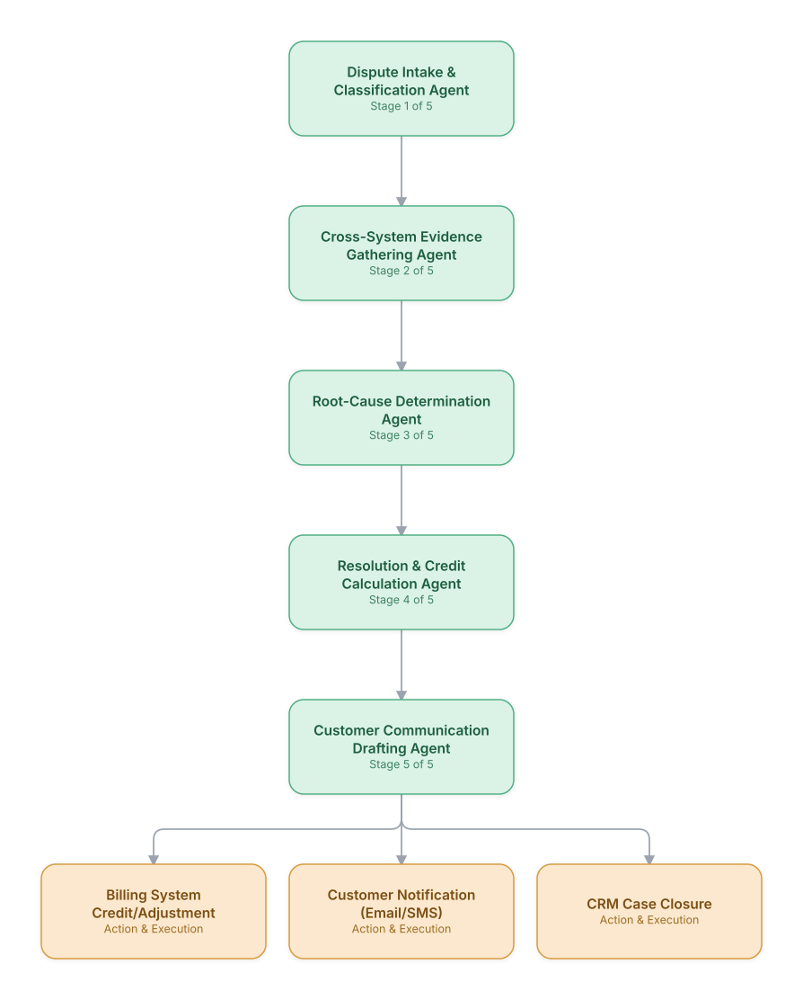

# 10. Billing Dispute Investigation & Resolution

**Domain:** Telecommunications &nbsp;|&nbsp; **Architecture pattern:** [Sequential Pipeline]({{ '/patterns/pipeline/' | relative_url }})

> 🧠 **Deep dive available:** this use case also has a full [8-Layer Regenerative Architecture breakdown]({{ '/deep8/telecom/10-billing-dispute-resolution/' | relative_url }}) — the same problem mapped through L1–L8, with an agent-level tools/technologies stack and a suggested build order by layer.

## 1. Problem Statement & Use Case

Billing disputes (unexpected roaming charges, double-billing, promo-not-applied) require pulling data across billing, rating, mediation, and CRM systems — a process that today takes agents 15-30 minutes of manual cross-system lookup per case. An agentic pipeline can auto-investigate the majority of disputes and produce a ready-to-approve resolution in seconds.

## 2. End-to-End Multi-Agent Architecture

The solution is implemented as a **Sequential Pipeline** architecture. 
### 2.1 Agents & Sub-Agents

| Agent | Responsibility |
|---|---|
| Dispute Intake & Classification Agent | Parses the customer's dispute text/call transcript and classifies dispute type |
| Cross-System Evidence Gathering Agent | Pulls CDRs, rating engine logs, promo eligibility, and mediation records for the billing period |
| Root-Cause Determination Agent | Reasons over gathered evidence to determine if the charge was correct, a system error, or a promo miss |
| Resolution & Credit Calculation Agent | Computes the exact credit/adjustment amount per policy rules |
| Customer Communication Agent | Drafts a clear, empathetic explanation and resolution notice |

### 2.2 Architecture Diagram

> This diagram is organized as a **layered architecture**: Data &amp; Integration → Orchestration → Agent →
> Action &amp; Execution, plus a cross-cutting Observability &amp; Governance layer (tracing, audit log,
> guardrails, and any human review checkpoint — shown in lavender). See the
> [E2E Platform Architecture]({{ '/architecture/e2e-platform-architecture/' | relative_url }}) for how this
> layering looks across all 60 use cases at once. A [Mermaid text source](architecture.mmd) of the same
> diagram is also available in this folder.

## 3. Technologies Used (per step)

| Step / Layer | Technology |
|---|---|
| Intake/classification | LLM classifier over dispute transcript/ticket text |
| Evidence gathering | Tool-calling agent hitting billing (Amdocs/CSG), mediation, and CRM APIs |
| Root cause reasoning | Claude with structured evidence context and policy-rule tool access |
| Credit calculation | Deterministic rules engine (not LLM) for financial calculation accuracy |
| Communication drafting | LLM template-grounded generation with brand voice guidelines |
| Orchestration | Sequential pipeline via Temporal workflow for durability/retries |
| Audit trail | Full evidence + reasoning trace stored for regulatory/dispute audit |
| Human review queue | Low-confidence or high-value disputes routed to billing specialist |

## 4. Suggested Build Order

**Phase 1 — the first two stages only.** Get Dispute Intake & Classification Agent feeding Cross-System Evidence Gathering Agent correctly, with the rest of the pipeline stubbed out. Durability matters more than completeness here — make sure a crash mid-pipeline doesn't lose or duplicate work.

**Phase 2 — the full chain.** Add the remaining 3 stages in order, testing each newly-added stage against real output from the stage before it, not synthetic test data.

**Phase 3 — add retry and partial-failure handling.** Decide, stage by stage, what happens when that specific stage fails: retry, skip, or halt the whole pipeline. This decision is different per stage and shouldn't be a single global policy.

**Phase 4 — observability and feedback.** Add per-stage tracing so a slow or wrong pipeline run can be attributed to one specific stage, and track output quality over time to catch silent degradation in an early stage before it compounds downstream.

## 5. If We Rebuilt This: What Would Improve

- Kept credit calculation strictly rules-based (not LLM-generated) after an early prototype produced a plausible-but-wrong dollar amount — a hard lesson on where not to trust generative reasoning.
- Add a pattern-detection agent across disputes to surface systemic billing bugs (e.g., a promo misconfiguration), not just resolve cases one by one.
- Would parallelize evidence-gathering calls (billing, mediation, CRM) rather than the initial sequential pipeline, cutting latency significantly.
- Communication drafts needed tighter regulatory-language review; added a compliance-phrase checklist agent step after an early miss.

---
[← Back to Telecommunications index]({{ '/telecom/' | relative_url }}) &nbsp;|&nbsp; [← Back to home]({{ '/' | relative_url }})
