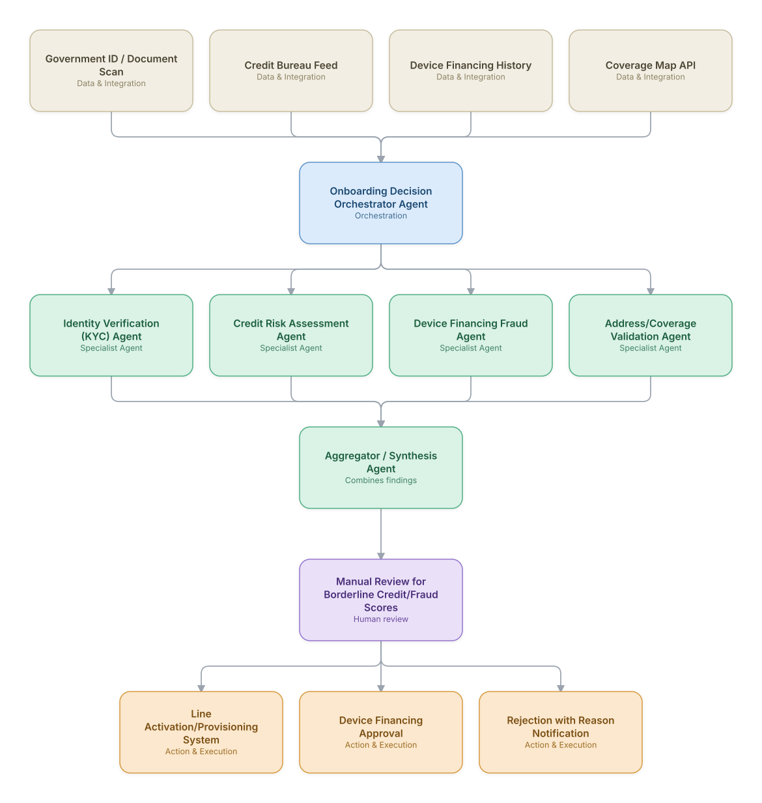

# 11. New Line/Device Onboarding & KYC Automation

**Domain:** Telecommunications &nbsp;|&nbsp; **Architecture pattern:** [Orchestrator-Worker (Supervisor fan-out/fan-in)]({{ '/patterns/orchestrator-worker/' | relative_url }})

> 🧠 **Deep dive available:** this use case also has a full [8-Layer Regenerative Architecture breakdown]({{ '/deep8/telecom/11-line-onboarding-kyc-automation/' | relative_url }}) — the same problem mapped through L1–L8, with an agent-level tools/technologies stack and a suggested build order by layer.

## 1. Problem Statement & Use Case

Activating a new postpaid line or financed device requires identity verification, credit risk assessment, fraud screening, and provisioning — historically siloed steps causing 20+ minute in-store waits or online drop-off. A coordinated agent team can run these checks in parallel and assemble a single go/no-go decision with reasons, in near real time.

## 2. End-to-End Multi-Agent Architecture

The solution is implemented as a **Orchestrator-Worker (Supervisor fan-out/fan-in)** architecture. 
**Human-in-the-loop checkpoint:** Manual Review for Borderline Credit/Fraud Scores

### 2.1 Agents & Sub-Agents

| Agent | Responsibility |
|---|---|
| Onboarding Decision Orchestrator | Coordinates parallel checks and produces a single, explainable activation decision |
| Identity Verification (KYC) Agent | Validates government ID via document/liveness check and matches against application |
| Credit Risk Assessment Agent | Pulls credit bureau data and computes a plan/device eligibility tier |
| Device Financing Fraud Agent | Screens for synthetic-identity and device-financing fraud patterns |
| Address/Coverage Validation Agent | Confirms service address is within coverage and eligible for the requested plan |

### 2.2 Architecture Diagram

> This diagram is organized as a **layered architecture**: Data &amp; Integration → Orchestration → Agent →
> Action &amp; Execution, plus a cross-cutting Observability &amp; Governance layer (tracing, audit log,
> guardrails, and any human review checkpoint — shown in lavender). See the
> [E2E Platform Architecture]({{ '/architecture/e2e-platform-architecture/' | relative_url }}) for how this
> layering looks across all 60 use cases at once. A [Mermaid text source](architecture.mmd) of the same
> diagram is also available in this folder.

## 3. Technologies Used (per step)

| Step / Layer | Technology |
|---|---|
| Document/ID verification | Onfido/Jumio API for document + liveness verification |
| Credit data | Credit bureau API (Experian/Equifax) integration |
| Fraud scoring | Graph-based synthetic identity detection model |
| Coverage check | Internal coverage-map geospatial API (PostGIS) |
| Orchestration | LangGraph supervisor with parallel tool calls and timeout handling |
| Decisioning | Explainable scorecard combining agent outputs with policy thresholds |
| Provisioning | OSS activation API (order management system) |
| Compliance logging | Immutable decision log for fair-lending/regulatory audit |

## 4. Suggested Build Order

**Phase 1 — one worker, no fan-out.** Wire a single path end to end: Identity Verification (KYC) Agent reading real data and producing a result, with Onboarding Decision Orchestrator Agent just passing data through untouched. Prove the data pipeline and one agent's reasoning before adding parallelism.

**Phase 2 — add the fan-out.** Bring the remaining 3 worker agents online in parallel and build Onboarding Decision Orchestrator Agent's aggregation/synthesis logic. This is where the orchestrator-worker pattern is actually learned — watch for race conditions and partial-failure handling here, not before.

**Phase 3 — add the governance gate.** Wire in the human checkpoint: Manual Review for Borderline Credit/Fraud Scores.

**Phase 4 — observability and feedback.** Trace every worker call, monitor the aggregator's decision quality against real outcomes, and add a feedback loop that catches drift before it becomes a production incident.

## 5. If We Rebuilt This: What Would Improve

- Would define clear timeout/fallback behavior per worker agent from day one — an early version stalled the whole onboarding flow when one bureau API was slow.
- Add an explicit 'reason codes' contract so rejected applicants get actionable, compliant reasons rather than an opaque decline.
- Separate fraud-score threshold tuning from credit-score threshold tuning; conflating them in v1 made bias/fairness audits harder.
- Introduce a shadow-mode period for any new worker agent (score but don't decide) before it can affect the activation decision.

---
[← Back to Telecommunications index]({{ '/telecom/' | relative_url }}) &nbsp;|&nbsp; [← Back to home]({{ '/' | relative_url }})
