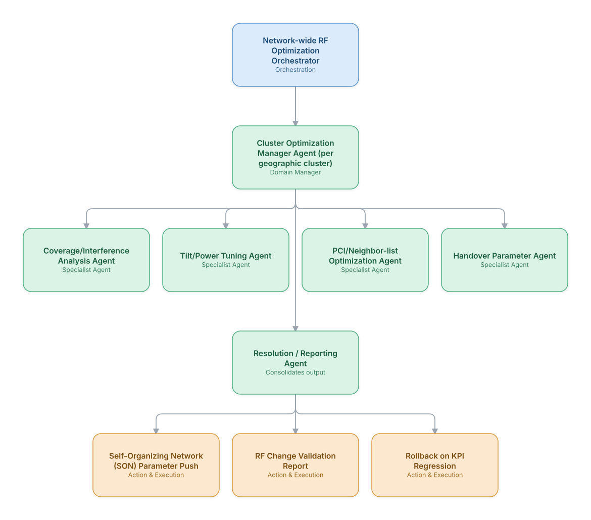

# 12. RF / Cell-Site Planning & Optimization

**Domain:** Telecommunications &nbsp;|&nbsp; **Architecture pattern:** [Hierarchical Multi-Agent (Manager-of-Managers)]({{ '/patterns/hierarchical/' | relative_url }})

> 🧠 **Deep dive available:** this use case also has a full [8-Layer Regenerative Architecture breakdown]({{ '/deep8/telecom/12-rf-cell-site-planning-optimization/' | relative_url }}) — the same problem mapped through L1–L8, with an agent-level tools/technologies stack and a suggested build order by layer.

## 1. Problem Statement & Use Case

Optimizing RF parameters (tilt, power, PCI, handover thresholds) across thousands of cells to balance coverage, capacity, and interference is a continuous, multi-objective problem that RF engineers can only review a fraction of manually. A hierarchical agent system spanning cluster-level and cell-level optimization can propose and validate parameter changes at scale.

## 2. End-to-End Multi-Agent Architecture

The solution is implemented as a **Hierarchical Multi-Agent (Manager-of-Managers)** architecture. 
### 2.1 Agents & Sub-Agents

| Agent | Responsibility |
|---|---|
| Network-wide RF Optimization Orchestrator | Prioritizes clusters needing optimization based on KPI degradation and complaint density |
| Cluster Optimization Manager Agent | Coordinates cell-level agents within a geographic cluster and resolves inter-cell trade-offs |
| Coverage/Interference Analysis Agent | Models coverage overlap and interference from PM data and drive-test/crowdsourced data |
| Tilt/Power Tuning Agent | Proposes antenna tilt and power adjustments to balance coverage vs. capacity |
| PCI/Neighbor-list Optimization Agent | Detects and resolves PCI conflicts and missing neighbor relations |
| Handover Parameter Agent | Tunes A3/A5 handover thresholds to reduce ping-pong and dropped handovers |

### 2.2 Architecture Diagram

> This diagram is organized as a **layered architecture**: Data &amp; Integration → Orchestration → Agent →
> Action &amp; Execution, plus a cross-cutting Observability &amp; Governance layer (tracing, audit log,
> guardrails, and any human review checkpoint — shown in lavender). See the
> [E2E Platform Architecture]({{ '/architecture/e2e-platform-architecture/' | relative_url }}) for how this
> layering looks across all 60 use cases at once. A [Mermaid text source](architecture.mmd) of the same
> diagram is also available in this folder.

## 3. Technologies Used (per step)

| Step / Layer | Technology |
|---|---|
| SON platform | 3GPP SON functions integrated via vendor EMS (Ericsson ENM/Nokia NetAct) |
| Propagation modeling | Ray-tracing / statistical propagation models (Atoll/iBwave data) |
| Optimization | Multi-objective Bayesian optimization per cluster |
| Agent orchestration | Hierarchical LangGraph with cluster sub-graphs run in scheduled batches |
| Validation | Digital twin simulation before pushing parameter changes to production |
| Crowdsourced data | MDT (Minimization of Drive Tests) + crowdsourced RF data ingestion |
| Rollback safety | Automatic KPI-regression detection triggering parameter rollback |
| Reporting | RF engineer dashboard with before/after KPI comparison per change |

## 4. Suggested Build Order

**Phase 1 — one branch only.** Build Network-wide RF Optimization Orchestrator talking to just Cluster Optimization Manager Agent (per geographic cluster) and that manager's own leaf agents, ignoring the other 0 branch entirely. Prove one full manager-to-leaf chain before replicating it.

**Phase 2 — add the remaining branches.** Bring  online, each with their own leaf agents. Build Network-wide RF Optimization Orchestrator's cross-branch consolidation logic — this is the actual hard part of the hierarchical pattern, not any single branch.

**Phase 3 — resolve cross-branch conflicts.** Real inputs will disagree across managers (different branches recommending incompatible actions); add explicit conflict-resolution logic at Network-wide RF Optimization Orchestrator rather than letting the last branch to report silently win.

**Phase 4 — observability and feedback.** Trace decisions at every level of the hierarchy separately (top orchestrator, each manager, each leaf) so a bad outcome can be traced to the specific branch and level that caused it.

## 5. If We Rebuilt This: What Would Improve

- Added a mandatory digital-twin validation gate after an early direct-to-production tilt change caused unexpected coverage holes in an adjacent cluster.
- Would model inter-cluster interference explicitly from the start — treating clusters as fully independent caused optimization thrashing at cluster boundaries.
- Batch optimization cadence (weekly) was too slow for fast-changing hotspots; added an event-triggered fast path for acute congestion.
- RF engineers wanted more control over 'why' — added a rationale/explanation output per proposed change, not just the new parameter value.

---
[← Back to Telecommunications index]({{ '/telecom/' | relative_url }}) &nbsp;|&nbsp; [← Back to home]({{ '/' | relative_url }})
