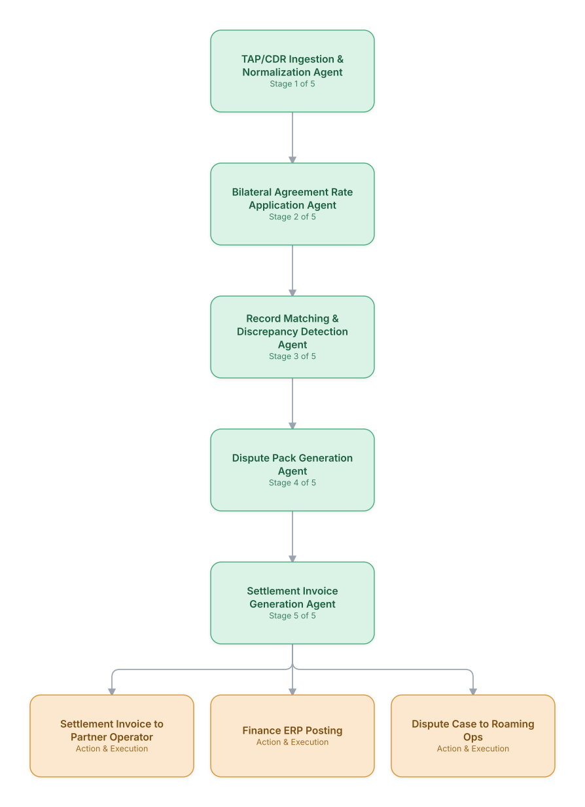

# 13. Roaming Partner Settlement Reconciliation

**Domain:** Telecommunications &nbsp;|&nbsp; **Architecture pattern:** [Sequential Pipeline](../../patterns/pipeline.md)

> 🧠 **Deep dive available:** this use case also has a full [8-Layer Regenerative Architecture breakdown](../../deep8/telecom/13-roaming-settlement-reconciliation/README.md) — the same problem mapped through L1–L8, with an agent-level tools/technologies stack and a suggested build order by layer.

## 1. Problem Statement & Use Case

Cross-carrier roaming settlement requires reconciling TAP/CDR records between operators, applying complex bilateral agreement terms, and resolving discrepancies before invoicing — a process finance teams run manually each month with significant leakage from unresolved disputes. An agent pipeline can automate matching, discrepancy detection, and dispute-pack generation.

## 2. End-to-End Multi-Agent Architecture

The solution is implemented as a **Sequential Pipeline** architecture. 
### 2.1 Agents & Sub-Agents

| Agent | Responsibility |
|---|---|
| TAP/CDR Ingestion Agent | Parses TAP3 files and internal CDRs into a normalized common schema |
| Bilateral Agreement Rate Agent | Applies the correct wholesale rates per partner agreement and traffic type |
| Record Matching Agent | Matches inbound/outbound records between operator and partner files, flags mismatches |
| Discrepancy Detection Agent | Classifies discrepancy root cause (rate mismatch, missing CDR, duplicate) with evidence |
| Dispute Pack Generation Agent | Assembles a partner-ready dispute package with supporting CDR evidence |
| Settlement Invoice Agent | Generates the final net settlement invoice after resolved discrepancies |

### 2.2 Architecture Diagram

> This diagram is organized as a **layered architecture**: Data &amp; Integration → Orchestration → Agent →
> Action &amp; Execution, plus a cross-cutting Observability &amp; Governance layer (tracing, audit log,
> guardrails, and any human review checkpoint — shown in lavender). See the
> [E2E Platform Architecture](../../architecture/e2e-platform-architecture.md) for how this layering looks
> across all 60 use cases at once. A [Mermaid text source](architecture.mmd) of the same diagram is also
> available in this folder.

## 3. Technologies Used (per step)

| Step / Layer | Technology |
|---|---|
| File ingestion | TAP3/RAP file parsers (GSMA standard) in a Spark ETL pipeline |
| Rate engine | Rules engine encoding bilateral roaming agreement terms |
| Matching algorithm | Probabilistic record-linkage (fuzzy matching on IMSI/timestamp/duration) |
| Discrepancy classification | LLM-assisted root-cause classification over matched-record diffs |
| Orchestration | Airflow monthly settlement pipeline with agent tasks |
| Dispute documentation | Automated PDF/Excel pack generation with evidence attachments |
| ERP integration | SAP/Oracle Financials posting via API |
| Audit | Full lineage tracking from raw TAP file to final invoice line item |

## 4. Suggested Build Order

**Phase 1 — the first two stages only.** Get TAP/CDR Ingestion & Normalization Agent feeding Bilateral Agreement Rate Application Agent correctly, with the rest of the pipeline stubbed out. Durability matters more than completeness here — make sure a crash mid-pipeline doesn't lose or duplicate work.

**Phase 2 — the full chain.** Add the remaining 3 stages in order, testing each newly-added stage against real output from the stage before it, not synthetic test data.

**Phase 3 — add retry and partial-failure handling.** Decide, stage by stage, what happens when that specific stage fails: retry, skip, or halt the whole pipeline. This decision is different per stage and shouldn't be a single global policy.

**Phase 4 — observability and feedback.** Add per-stage tracing so a slow or wrong pipeline run can be attributed to one specific stage, and track output quality over time to catch silent degradation in an early stage before it compounds downstream.

## 5. If We Rebuilt This: What Would Improve

- Fuzzy matching thresholds needed per-partner tuning (different clock-sync tolerances); a single global threshold in v1 over-flagged discrepancies with some partners.
- Would add a partner-facing self-service discrepancy-status portal instead of email-based dispute packs, which slowed resolution cycles.
- Discrepancy root-cause classification accuracy improved substantially after adding historical resolution outcomes as few-shot examples.
- Settlement currency/FX handling was an afterthought; would design multi-currency support into the rate-application agent from the start.

---
[← Back to Telecommunications index](../README.md) &nbsp;|&nbsp; [← Back to home](../../../README.md)
