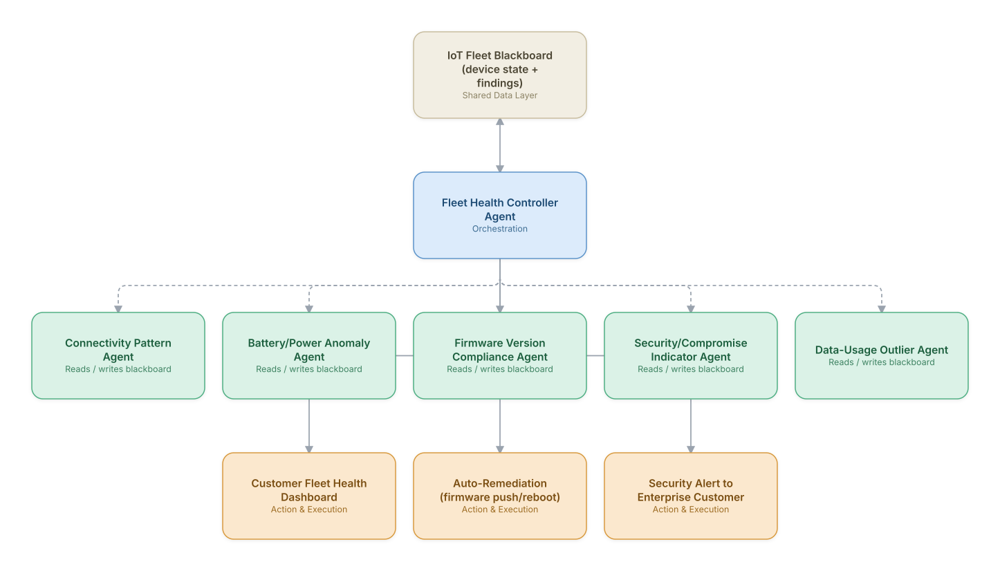

# 14. IoT Device Fleet Anomaly Detection & Remediation

**Domain:** Telecommunications &nbsp;|&nbsp; **Architecture pattern:** [Blackboard / Shared-Memory](../../patterns/blackboard.md)

> 🧠 **Deep 8-Layer Regenerative Architecture:** not yet built for this use case — see the [Deep 8-Layer view](../../deep8/README.md) for what's currently available.

## 1. Problem Statement & Use Case

Enterprise IoT customers (fleet trackers, smart meters, industrial sensors) run millions of connected devices on the operator's network. Device-level anomalies (battery drain, firmware issues, connectivity flapping, potential compromise) are hard to see individually but form clear patterns at fleet scale. A blackboard architecture lets specialized agents post partial findings that a controller synthesizes into fleet-level insight and per-device action.

## 2. End-to-End Multi-Agent Architecture

The solution is implemented as a **Blackboard / Shared-Memory** architecture. 
### 2.1 Agents & Sub-Agents

| Agent | Responsibility |
|---|---|
| Fleet Health Controller Agent | Watches the blackboard, decides which specialist agents to trigger, and synthesizes fleet-level findings |
| Connectivity Pattern Agent | Posts findings on devices with abnormal attach/detach or signal-loss patterns |
| Battery/Power Anomaly Agent | Detects devices with abnormal battery drain vs. their device-model baseline |
| Firmware Version Compliance Agent | Flags devices on vulnerable/outdated firmware versions |
| Security/Compromise Indicator Agent | Posts findings on devices showing botnet-like traffic patterns |
| Data-Usage Outlier Agent | Flags devices with usage far outside their expected profile (cost/billing risk for the enterprise customer) |

### 2.2 Architecture Diagram

> This diagram is organized as a **layered architecture**: Data &amp; Integration → Orchestration → Agent →
> Action &amp; Execution, plus a cross-cutting Observability &amp; Governance layer (tracing, audit log,
> guardrails, and any human review checkpoint — shown in lavender). See the
> [E2E Platform Architecture](../../architecture/e2e-platform-architecture.md) for how this layering looks
> across all 60 use cases at once. A [Mermaid text source](architecture.mmd) of the same diagram is also
> available in this folder.

## 3. Technologies Used (per step)

| Step / Layer | Technology |
|---|---|
| Blackboard store | Redis/DynamoDB shared state store keyed by device ID |
| Device telemetry | IoT connectivity platform (e.g., operator's IoT CMP) streaming via MQTT/Kafka |
| Anomaly agents | Per-signal statistical/ML anomaly detectors (Isolation Forest, seasonal baselines) |
| Security detection | Traffic fingerprinting against known botnet C2 signatures |
| Controller reasoning | Claude synthesizing multi-agent blackboard entries into a fleet health narrative |
| Remediation | Firmware-over-the-air (FOTA) trigger + device reboot via CMP API |
| Customer-facing dashboard | Multi-tenant React dashboard with per-fleet drill-down |
| Alerting | Webhook/email alerts to enterprise customer's ops team |

## 4. Suggested Build Order

**Phase 1 — one agent writing to the blackboard.** Get Connectivity Pattern Agent reading and writing the shared store with Fleet Health Controller Agent just reading it back out, no synthesis logic yet. Prove the shared-state read/write mechanics before adding more writers.

**Phase 2 — add the remaining agents.** Bring Battery/Power Anomaly Agent, Firmware Version Compliance Agent, Security/Compromise Indicator Agent, Data-Usage Outlier Agent online, each writing independently to the blackboard. Build Fleet Health Controller Agent's synthesis logic — deciding which agent to trigger next and how to combine partial, sometimes-conflicting findings.

**Phase 3 — add a minimum-evidence threshold.** An early blackboard system will over-synthesize from sparse data; require a minimum number of corroborating agent findings before the controller surfaces a conclusion.

**Phase 4 — observability and feedback.** Snapshot the blackboard's state history so any synthesized conclusion can be traced back to exactly which agent findings produced it.

## 5. If We Rebuilt This: What Would Improve

- Blackboard grew unbounded for large fleets (10M+ devices); added TTL-based pruning and per-fleet partitioning to keep controller reasoning tractable.
- Would add device-model-specific baselines from the start — a single global battery-drain baseline produced too many false positives for heterogeneous device types.
- Controller occasionally over-synthesized (inventing fleet-level trends from sparse data); added a minimum-evidence threshold before surfacing a finding.
- Security indicator agent needed tighter false-positive control before auto-alerting enterprise customers; added a confidence-tiered alerting policy after early complaints.

---
[← Back to Telecommunications index](../README.md) &nbsp;|&nbsp; [← Back to home](../../../README.md)
