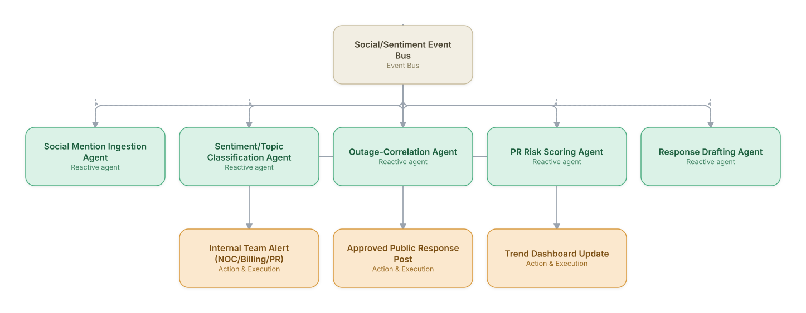

# 15. Customer Sentiment & Social Listening to Action

**Domain:** Telecommunications &nbsp;|&nbsp; **Architecture pattern:** [Event-Driven Reactive Swarm](../../patterns/event-swarm.md)

> 🧠 **Deep 8-Layer Regenerative Architecture:** not yet built for this use case — see the [Deep 8-Layer view](../../deep8/README.md) for what's currently available.

## 1. Problem Statement & Use Case

Service outages and billing issues trend on social media faster than internal monitoring detects them. Brand and comms teams need real-time detection of sentiment spikes tied to specific issues, with automatic routing to the right internal team (NOC, billing, PR) rather than manual monitoring dashboards nobody watches continuously.

## 2. End-to-End Multi-Agent Architecture

The solution is implemented as a **Event-Driven Reactive Swarm** architecture. 
### 2.1 Agents & Sub-Agents

| Agent | Responsibility |
|---|---|
| Social Mention Ingestion Agent | Streams mentions from X/Reddit/app-store reviews/forums via listening APIs |
| Sentiment/Topic Classification Agent | Classifies sentiment and topic (outage, billing, device, competitor comparison) |
| Outage-Correlation Agent | Cross-checks sentiment spikes against live NOC outage data to confirm root cause |
| PR Risk Scoring Agent | Scores the reputational risk/velocity of a trending topic |
| Response Drafting Agent | Drafts on-brand public/internal responses for human approval |

### 2.2 Architecture Diagram

> This diagram is organized as a **layered architecture**: Data &amp; Integration → Orchestration → Agent →
> Action &amp; Execution, plus a cross-cutting Observability &amp; Governance layer (tracing, audit log,
> guardrails, and any human review checkpoint — shown in lavender). See the
> [E2E Platform Architecture](../../architecture/e2e-platform-architecture.md) for how this layering looks
> across all 60 use cases at once. A [Mermaid text source](architecture.mmd) of the same diagram is also
> available in this folder.

## 3. Technologies Used (per step)

| Step / Layer | Technology |
|---|---|
| Social listening | Brandwatch/Sprinklr API + X/Reddit APIs |
| Sentiment/topic model | Fine-tuned transformer classifier + LLM for nuanced/sarcasm cases |
| Event bus | Kafka topics per source, consumed by downstream agents |
| Outage correlation | Direct query to NOC outage API for geographic/time correlation |
| Risk scoring | Velocity + reach-weighted scoring model |
| Response drafting | Claude with brand-voice guidelines and legal-approved phrase library |
| Human approval workflow | Slack-based approve/edit/reject workflow before any public post |
| Dashboard | Real-time trend dashboard for comms/exec team |

## 4. Suggested Build Order

**Phase 1 — one reactive agent.** Get Social Mention Ingestion Agent subscribed to Social/Sentiment Event Bus and reacting to real events, with no other agents listening yet. Prove the event-driven mechanics work under real event volume before adding more subscribers.

**Phase 2 — add the remaining agents.** Bring Sentiment/Topic Classification Agent, Outage-Correlation Agent, PR Risk Scoring Agent, Response Drafting Agent online as independent subscribers. Test what happens when multiple agents react to the *same* event — this is where swarm-specific bugs (duplicate actions, conflicting responses) show up.

**Phase 3 — add rate limits and blast-radius guardrails.** A reactive swarm with no shared coordination can act on the same trigger repeatedly; add per-agent and global rate limits before connecting real downstream actions.

**Phase 4 — observability and feedback.** Add distributed tracing across the event bus so a cascading reaction across multiple agents can be reconstructed after the fact, not just guessed at.

## 5. If We Rebuilt This: What Would Improve

- All public-facing responses require human approval by design; would keep this hard constraint even as automation matures elsewhere in the system.
- Sarcasm/negation handling was a major early accuracy gap in sentiment classification; LLM-based re-scoring of borderline cases improved precision substantially.
- Would add rate-limiting on internal alerts — early version paged NOC/billing teams too often on minor sentiment noise before risk-scoring thresholds were calibrated.
- Outage correlation agent needed geographic granularity matching (city vs. national) — mismatched granularity caused false negative correlations initially.

---
[← Back to Telecommunications index](../README.md) &nbsp;|&nbsp; [← Back to home](../../../README.md)
