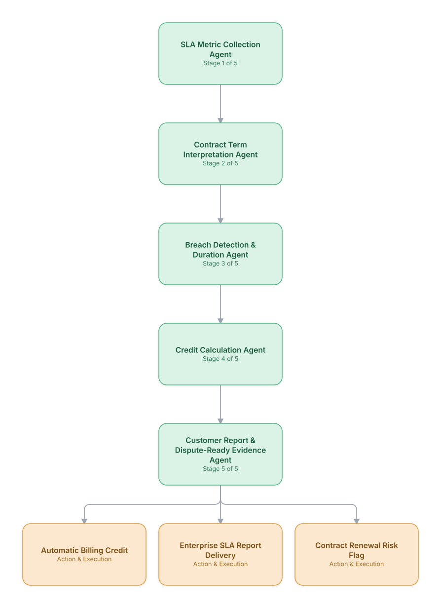

# 17. Enterprise SLA Compliance Monitoring & Credit Automation

**Domain:** Telecommunications &nbsp;|&nbsp; **Architecture pattern:** [Sequential Pipeline](../../patterns/pipeline.md)

> 🧠 **Deep dive available:** this use case also has a full [8-Layer Regenerative Architecture breakdown](../../deep8/telecom/17-enterprise-sla-compliance-monitoring/README.md) — the same problem mapped through L1–L8, with an agent-level tools/technologies stack and a suggested build order by layer.

## 1. Problem Statement & Use Case

Enterprise connectivity contracts carry strict uptime/latency SLAs with financial penalties. Operators often under-report breaches (manual, error-prone tracking) or over-pay credits due to measurement disputes. An automated pipeline continuously monitors SLA metrics per contract and computes accurate, auditable credits.

## 2. End-to-End Multi-Agent Architecture

The solution is implemented as a **Sequential Pipeline** architecture. 
### 2.1 Agents & Sub-Agents

| Agent | Responsibility |
|---|---|
| SLA Metric Collection Agent | Continuously pulls uptime/latency/jitter metrics per circuit from monitoring systems |
| Contract Term Interpretation Agent | Extracts SLA thresholds and credit formulas from the contract document (RAG over legal text) |
| Breach Detection & Duration Agent | Detects threshold breaches and computes precise breach duration per contract's measurement window rules |
| Credit Calculation Agent | Applies the contract-specific credit formula to compute the exact billing credit |
| Customer Report Agent | Generates a transparent SLA compliance report with evidence, reducing dispute likelihood |

### 2.2 Architecture Diagram

> This diagram is organized as a **layered architecture**: Data &amp; Integration → Orchestration → Agent →
> Action &amp; Execution, plus a cross-cutting Observability &amp; Governance layer (tracing, audit log,
> guardrails, and any human review checkpoint — shown in lavender). See the
> [E2E Platform Architecture](../../architecture/e2e-platform-architecture.md) for how this layering looks
> across all 60 use cases at once. A [Mermaid text source](architecture.mmd) of the same diagram is also
> available in this folder.

## 3. Technologies Used (per step)

| Step / Layer | Technology |
|---|---|
| Metric collection | Network monitoring (ThousandEyes/SolarWinds) API polling |
| Contract parsing | LLM + RAG over contract PDFs (docx/pdf skill-generated extraction) to structure SLA terms |
| Breach detection | Rules engine applying contract-specific measurement windows and exclusions (maintenance windows) |
| Credit calculation | Deterministic financial calculation engine, LLM-generated formulas reviewed by legal before go-live |
| Orchestration | Temporal workflow running continuously per contract |
| Reporting | Automated PDF report generation with time-series evidence charts |
| Billing integration | Direct posting to billing system credit ledger |
| Audit trail | Immutable log of raw metrics → breach determination → credit amount |

## 4. Suggested Build Order

**Phase 1 — the first two stages only.** Get SLA Metric Collection Agent feeding Contract Term Interpretation Agent correctly, with the rest of the pipeline stubbed out. Durability matters more than completeness here — make sure a crash mid-pipeline doesn't lose or duplicate work.

**Phase 2 — the full chain.** Add the remaining 3 stages in order, testing each newly-added stage against real output from the stage before it, not synthetic test data.

**Phase 3 — add retry and partial-failure handling.** Decide, stage by stage, what happens when that specific stage fails: retry, skip, or halt the whole pipeline. This decision is different per stage and shouldn't be a single global policy.

**Phase 4 — observability and feedback.** Add per-stage tracing so a slow or wrong pipeline run can be attributed to one specific stage, and track output quality over time to catch silent degradation in an early stage before it compounds downstream.

## 5. If We Rebuilt This: What Would Improve

- Contract term interpretation needed human legal sign-off per contract template before automation — fully autonomous interpretation of legal language was too risky to trust blindly.
- Would build a contract-term versioning system from the start; contract amendments silently broke breach-detection logic in v1.
- Add proactive 'at-risk of breach' alerts to network ops, not just after-the-fact credit calculation — this turns the system from reactive accounting into a retention tool.
- Measurement-window edge cases (maintenance exclusions, force majeure) caused the most calculation disputes; would invest more upfront in exhaustive rule coverage.

---
[← Back to Telecommunications index](../README.md) &nbsp;|&nbsp; [← Back to home](../../../README.md)
