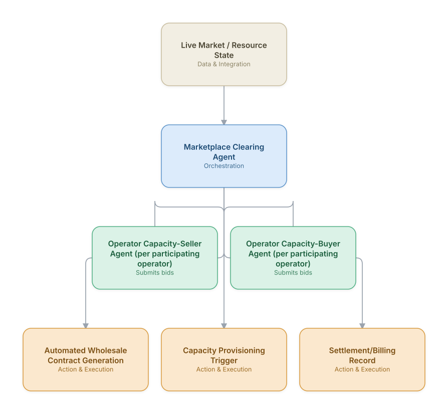

# 18. Wholesale Bandwidth Marketplace (Capacity Trading)

**Domain:** Telecommunications &nbsp;|&nbsp; **Architecture pattern:** [Market-Based / Auction Agents](../../patterns/market-based.md)

> 🧠 **Deep 8-Layer Regenerative Architecture:** not yet built for this use case — see the [Deep 8-Layer view](../../deep8/README.md) for what's currently available.

## 1. Problem Statement & Use Case

Operators with excess backbone/transit capacity in some routes and shortages in others could trade capacity wholesale, but manual bilateral negotiation is slow and inefficient at matching real-time supply and demand across a multi-operator marketplace. An agent-based marketplace lets each operator's capacity-selling and capacity-buying agents trade autonomously within pre-approved commercial policy.

## 2. End-to-End Multi-Agent Architecture

The solution is implemented as a **Market-Based / Auction Agents** architecture. 
### 2.1 Agents & Sub-Agents

| Agent | Responsibility |
|---|---|
| Marketplace Clearing Agent | Runs periodic double-auction clearing across all buy/sell offers, sets clearing prices per route |
| Capacity-Seller Agent | Represents an operator's excess capacity, posts sell offers within a pre-approved price floor |
| Capacity-Buyer Agent | Represents an operator's capacity shortfall, posts buy bids within a pre-approved price ceiling |
| Contract Generation Agent | Auto-drafts the wholesale capacity contract for matched trades per standard commercial terms |
| Provisioning Trigger Agent | Initiates cross-operator circuit provisioning once a trade clears and contract is signed |

### 2.2 Architecture Diagram

> This diagram is organized as a **layered architecture**: Data &amp; Integration → Orchestration → Agent →
> Action &amp; Execution, plus a cross-cutting Observability &amp; Governance layer (tracing, audit log,
> guardrails, and any human review checkpoint — shown in lavender). See the
> [E2E Platform Architecture](../../architecture/e2e-platform-architecture.md) for how this layering looks
> across all 60 use cases at once. A [Mermaid text source](architecture.mmd) of the same diagram is also
> available in this folder.

## 3. Technologies Used (per step)

| Step / Layer | Technology |
|---|---|
| Auction mechanism | Continuous double auction (CDA) engine |
| Agent policy | Each operator configures price bounds/risk policy; agents never exceed pre-approved commercial authority |
| Orchestration | Market-based agent framework with a neutral clearing service (potentially blockchain-notarized for trust) |
| Contract automation | Template-based smart-contract-style generation with legal review threshold |
| Provisioning | Cross-operator NNI (network-to-network interface) provisioning API |
| Settlement | Automated invoicing tied to actual provisioned/used capacity |
| Trust/security | Mutual authentication and audit logging across participating operators |
| Analytics | Market liquidity and price-trend dashboard for participating operators |

## 4. Suggested Build Order

**Phase 1 — two bidders, manual clearing.** Get Operator Capacity-Seller Agent (per participating operator) and Operator Capacity-Buyer Agent (per participating operator) submitting bids with Marketplace Clearing Agent clearing them on a fixed schedule — no real-time re-clearing yet.

**Phase 2 — add the remaining bidders and automate clearing.** Bring the rest of the bidder population online and move Marketplace Clearing Agent to event-triggered (not just scheduled) clearing.

**Phase 3 — add hard guardrails independent of the market mechanism.** A pure auction can clear at a technically-valid but operationally-bad price; add a guardrail service that can veto a clearing result regardless of what the market mechanism decided.

**Phase 4 — observability and feedback.** Track clearing-price trends and bidder participation over time — a market that's stopped clearing efficiently is a slow-motion failure that won't show up in any single transaction.

## 5. If We Rebuilt This: What Would Improve

- Would require a neutral, mutually-trusted clearing operator or consortium from day one — bilateral trust issues were the biggest adoption blocker, not the technology.
- Add circuit-breaker logic to pause trading during anomalous price swings, similar to financial market safeguards.
- Initial version cleared trades faster than provisioning teams could fulfill them; added provisioning-capacity awareness into the clearing agent's matching logic.
- Legal review of auto-generated contracts was a bottleneck; would pre-approve a narrower set of standard contract templates to reduce review overhead.

---
[← Back to Telecommunications index](../README.md) &nbsp;|&nbsp; [← Back to home](../../../README.md)
