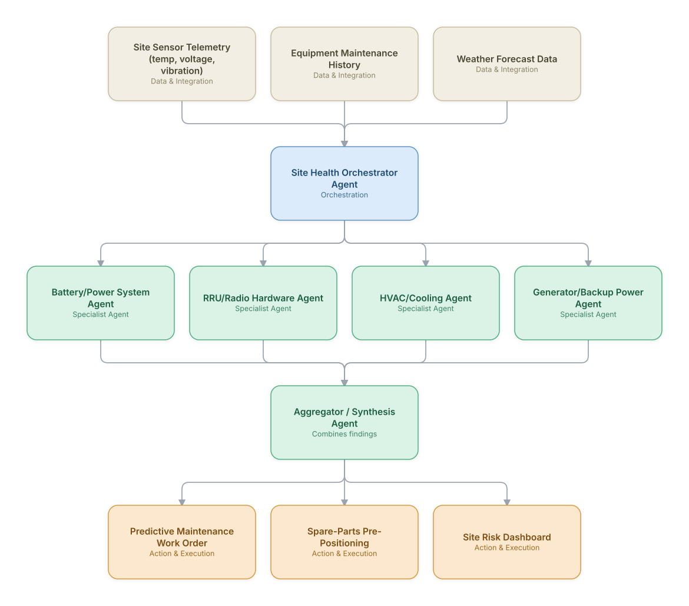

# 19. Predictive Maintenance for Network Hardware

**Domain:** Telecommunications &nbsp;|&nbsp; **Architecture pattern:** [Orchestrator-Worker (Supervisor fan-out/fan-in)](../../patterns/orchestrator-worker.md)

> 🧠 **Deep 8-Layer Regenerative Architecture:** not yet built for this use case — see the [Deep 8-Layer view](../../deep8/README.md) for what's currently available.

## 1. Problem Statement & Use Case

Reactive maintenance on RRUs, batteries, generators, and cooling systems at cell sites leads to unplanned outages and expensive emergency truck-rolls. Sensor data exists but is siloed per equipment type. A coordinated agent team can fuse multi-equipment signals into unified site-health scores and proactive maintenance schedules.

## 2. End-to-End Multi-Agent Architecture

The solution is implemented as a **Orchestrator-Worker (Supervisor fan-out/fan-in)** architecture. 
### 2.1 Agents & Sub-Agents

| Agent | Responsibility |
|---|---|
| Site Health Orchestrator | Fuses per-equipment health scores into an overall site risk ranking and maintenance schedule |
| Battery/Power System Agent | Predicts battery degradation and backup-runtime risk from voltage/temperature trends |
| RRU/Radio Hardware Agent | Detects early failure signatures in radio units (VSWR trends, temperature anomalies) |
| HVAC/Cooling Agent | Predicts cooling system failures that risk equipment overheating |
| Generator/Backup Power Agent | Tracks generator run-hours, fuel levels, and predicts maintenance-due dates |

### 2.2 Architecture Diagram

> This diagram is organized as a **layered architecture**: Data &amp; Integration → Orchestration → Agent →
> Action &amp; Execution, plus a cross-cutting Observability &amp; Governance layer (tracing, audit log,
> guardrails, and any human review checkpoint — shown in lavender). See the
> [E2E Platform Architecture](../../architecture/e2e-platform-architecture.md) for how this layering looks
> across all 60 use cases at once. A [Mermaid text source](architecture.mmd) of the same diagram is also
> available in this folder.

## 3. Technologies Used (per step)

| Step / Layer | Technology |
|---|---|
| Sensor ingestion | Site IoT gateway streaming to Kafka/AWS IoT Core |
| Predictive models | Per-equipment-type survival analysis / remaining-useful-life models (Weibull-based) |
| Orchestration | LangGraph supervisor combining worker outputs into a composite site risk score |
| Weather integration | Weather API for heat/storm risk adjustment on cooling and power predictions |
| Maintenance scheduling | Optimization to bundle nearby-site maintenance into efficient technician routes |
| Spare parts | Inventory system integration to pre-position likely-needed parts |
| Dashboard | Site risk heatmap for network operations leadership |
| Feedback loop | Actual failure events fed back to retrain remaining-useful-life models |

## 4. Suggested Build Order

**Phase 1 — one worker, no fan-out.** Wire a single path end to end: Battery/Power System Agent reading real data and producing a result, with Site Health Orchestrator Agent just passing data through untouched. Prove the data pipeline and one agent's reasoning before adding parallelism.

**Phase 2 — add the fan-out.** Bring the remaining 3 worker agents online in parallel and build Site Health Orchestrator Agent's aggregation/synthesis logic. This is where the orchestrator-worker pattern is actually learned — watch for race conditions and partial-failure handling here, not before.

**Phase 3 — add the governance gate.** Add policy/guardrail checks the aggregator's output must clear before it reaches the action layer.

**Phase 4 — observability and feedback.** Trace every worker call, monitor the aggregator's decision quality against real outcomes, and add a feedback loop that catches drift before it becomes a production incident.

## 5. If We Rebuilt This: What Would Improve

- Individual equipment models were accurate but the orchestrator's initial naive-average site score under-weighted correlated failure modes (e.g., cooling failure causing radio failure); moved to a Bayesian network-based fusion.
- Would integrate with the field-dispatch marketplace (use case 9) from the start rather than as a separate work-order silo.
- Add cost-benefit reasoning (maintenance cost vs. predicted outage cost) explicitly into the scheduling decision, not just risk ranking.
- Sensor data quality varied wildly by site vintage; would budget more upfront effort for sensor data-quality agents/validation before trusting predictions.

---
[← Back to Telecommunications index](../README.md) &nbsp;|&nbsp; [← Back to home](../../../README.md)
