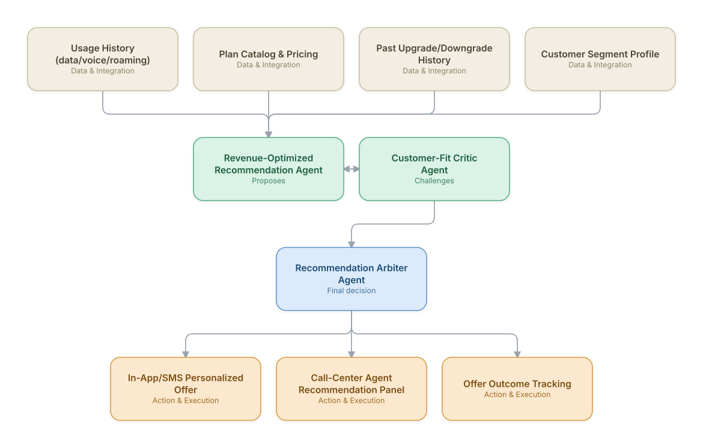

# 20. Personalized Plan Recommendation & Upsell Agent

**Domain:** Telecommunications &nbsp;|&nbsp; **Architecture pattern:** [Debate-Critique-Arbiter (Reflective Loop)](../../patterns/debate-critique.md)

> 🧠 **Deep 8-Layer Regenerative Architecture:** not yet built for this use case — see the [Deep 8-Layer view](../../deep8/README.md) for what's currently available.

## 1. Problem Statement & Use Case

Generic upsell campaigns (blanket 'upgrade to unlimited' offers) have low conversion and can push customers onto plans that don't fit their usage, increasing churn later. A reflective agent pair — one proposing a recommendation optimized for revenue and one critiquing it for actual customer fit — produces recommendations that are both profitable and durable.

## 2. End-to-End Multi-Agent Architecture

The solution is implemented as a **Debate-Critique-Arbiter (Reflective Loop)** architecture. 
### 2.1 Agents & Sub-Agents

| Agent | Responsibility |
|---|---|
| Revenue-Optimized Recommendation Agent | Proposes the plan/add-on combination maximizing expected revenue lift |
| Customer-Fit Critic Agent | Checks the proposal against actual usage patterns and flags likely-poor-fit or churn-risk recommendations |
| Recommendation Arbiter Agent | Balances revenue and fit signals into a final recommendation with a rationale |
| Offer Timing Agent | Determines the best moment to present the offer (e.g., after a positive support interaction) |
| Outcome Tracking Agent | Monitors acceptance, subsequent usage, and churn to close the feedback loop |

### 2.2 Architecture Diagram

> This diagram is organized as a **layered architecture**: Data &amp; Integration → Orchestration → Agent →
> Action &amp; Execution, plus a cross-cutting Observability &amp; Governance layer (tracing, audit log,
> guardrails, and any human review checkpoint — shown in lavender). See the
> [E2E Platform Architecture](../../architecture/e2e-platform-architecture.md) for how this layering looks
> across all 60 use cases at once. A [Mermaid text source](architecture.mmd) of the same diagram is also
> available in this folder.

## 3. Technologies Used (per step)

| Step / Layer | Technology |
|---|---|
| Usage analysis | Feature engineering on CDR/data-usage time series (Databricks) |
| Recommendation proposer | Uplift-modeling based recommender (causal ML) rather than plain propensity scoring |
| Fit critic | Rules + LLM reasoning comparing proposed plan against 90-day usage envelope |
| Arbitration | Weighted multi-objective scoring (expected revenue vs. predicted fit/churn risk) |
| Timing optimization | Contextual bandit selecting moment/channel |
| Delivery | In-app SDK + Braze/Twilio for outreach |
| Feedback loop | Outcome tracking feeding back into both proposer and critic model retraining |
| Experimentation | Built-in A/B testing framework to measure incremental lift vs. control |

## 4. Suggested Build Order

**Phase 1 — the proposer alone.** Get Revenue-Optimized Recommendation Agent producing a hypothesis from real data, with no critic yet — this is just a single-pass classifier/recommender at this stage, and that's fine.

**Phase 2 — add the critic, fully independent.** Build Customer-Fit Critic Agent with no visibility into the proposer's reasoning — separate context, separate prompt. This independence is the entire point of the pattern; skipping it turns the critic into a rubber stamp.

**Phase 3 — add Recommendation Arbiter Agent and calibrate.** Build the arbitration logic, then run it against a set of cases with known-correct outcomes to calibrate how much weight the critic's pushback should carry before trusting it on live decisions.

**Phase 4 — observability and feedback.** Track how often the arbiter overrides the proposer and whether those overrides were actually correct — this tells you whether the critic is earning its place in the pipeline or just adding latency.

## 5. If We Rebuilt This: What Would Improve

- Would formalize the critic's 'fit' threshold with real churn outcome data from the start; early thresholds were expert-guessed and too conservative, suppressing profitable offers.
- Add explicit guardrails against recommending downgrades that cut into revenue without clear churn-prevention justification.
- Arbiter's rationale output turned out valuable for call-center agents' trust in the tool — would make explanation-generation a first-class requirement, not an afterthought.
- Offer Timing Agent needed fatigue/frequency caps per customer, added after early over-messaging complaints.

---
[← Back to Telecommunications index](../README.md) &nbsp;|&nbsp; [← Back to home](../../../README.md)
